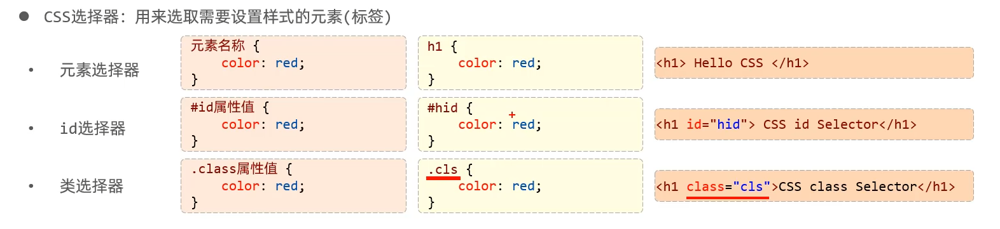
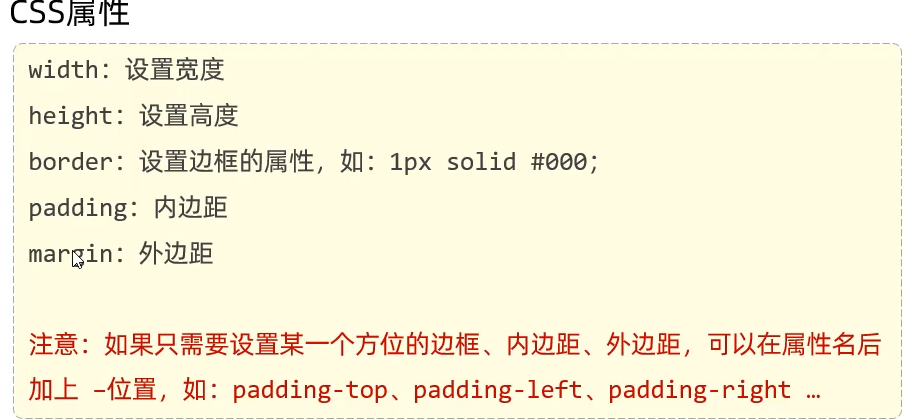

# css 选择器

优先级：id选择器 > 类选择器 > 元素选择器
# css属性
* color：设置文本的颜色
* font-size：字体大小 (注意：记得加px)
* text - decoration: 规定添加到文本的修饰,none表示定义标准的文本
* line-height:设置行高
* text-indent:定义第一行内容的缩进
* text-align:规定元素中的文本的对平对齐方式
**在HTML中无论输入多少个空格,都只会显示一个。可以使用空格占位符：&nbsp;**
