# Array
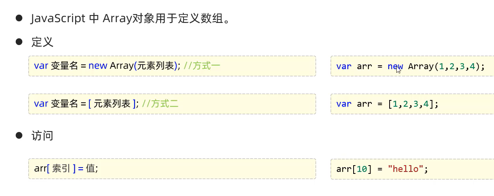

* 长度可变
* 类型可变

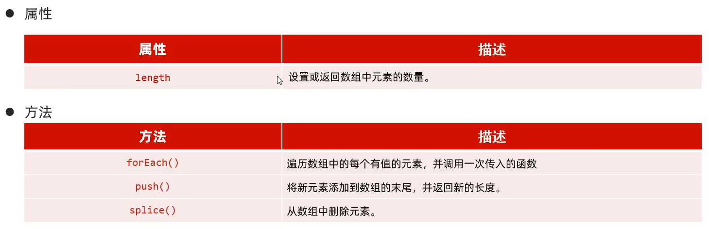

**箭头函数(ES6):是用来简化函数定义语法的。具体形式为:(...)=>{...},如果需要给箭头函数起名字：var xxx = (...)=>{...}**

---
# String

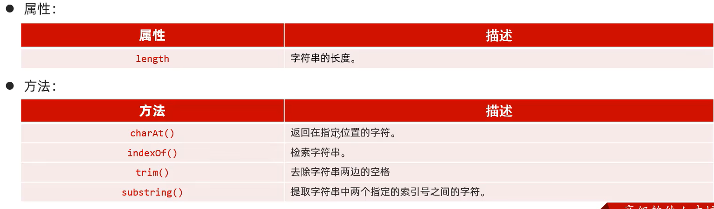

# 自定义对象

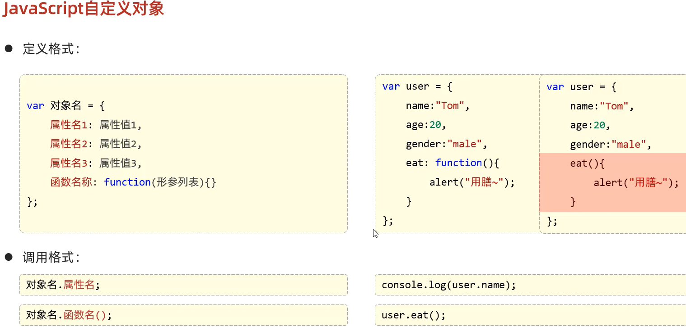

# JSON

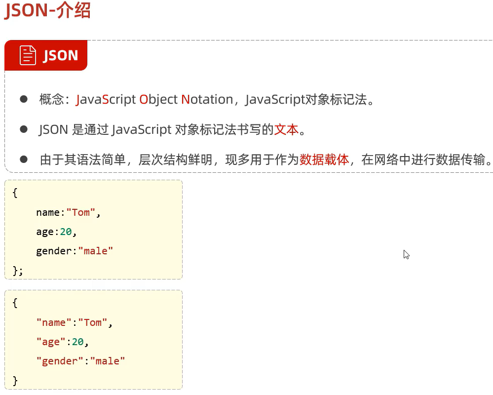

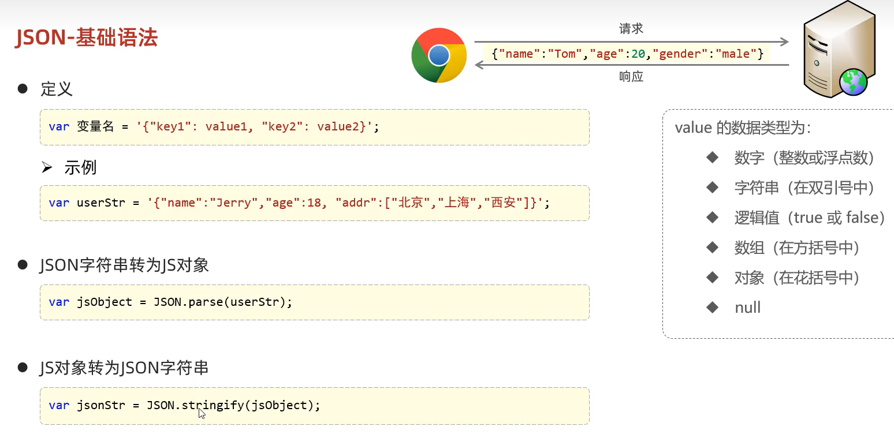

# BOM

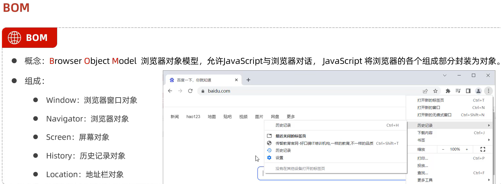

## Window

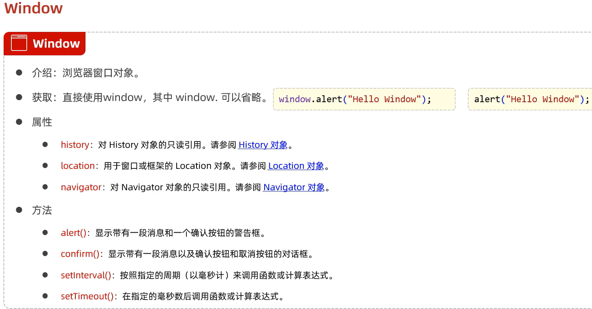

# Location

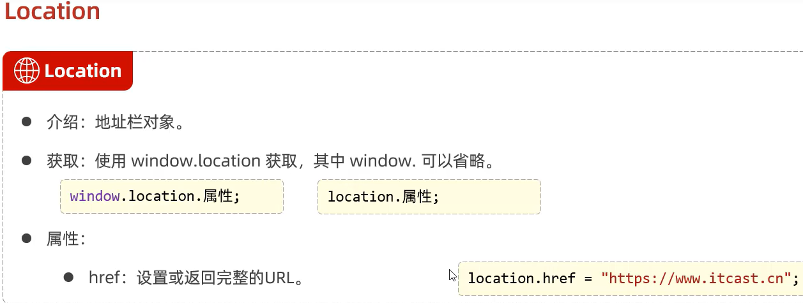

# DOM

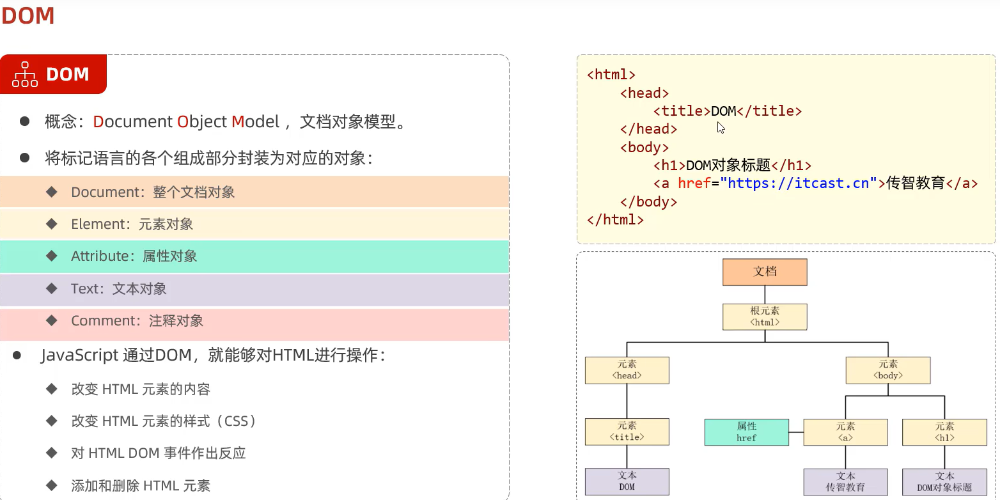

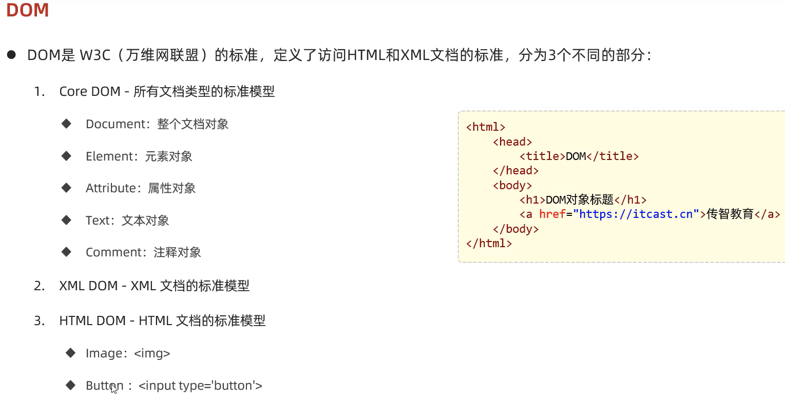

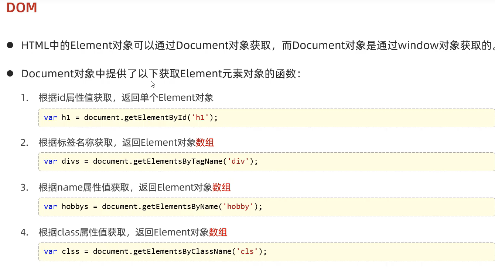

 

