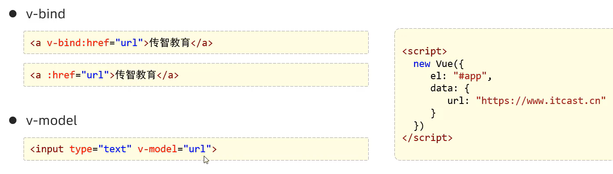
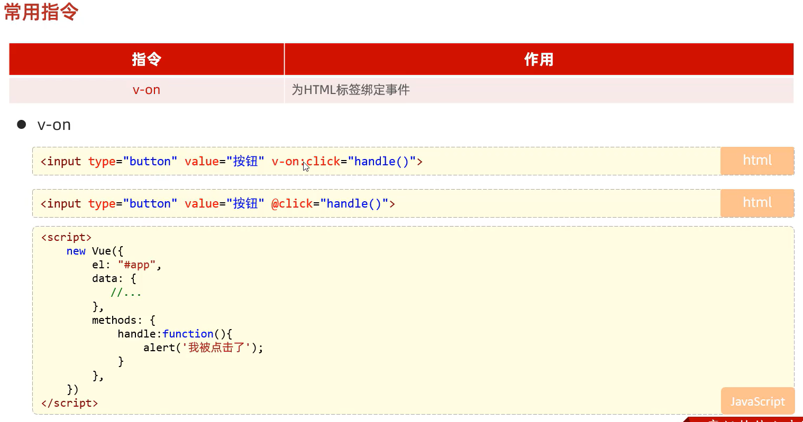
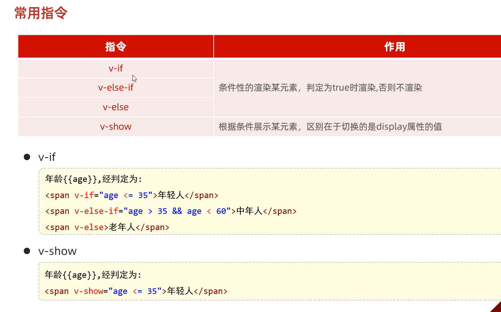
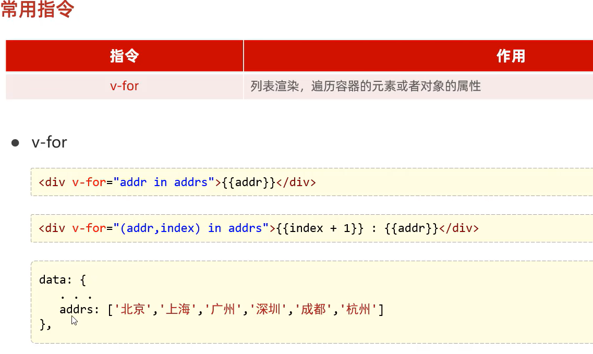

# 常用指令
* 指令：HTML标签上带有 v- 前缀的特殊属性,不同指令具有不同含义。例如：v-if,v-for...
* 常用指令

|指令|作用|
|---|---|
|v-bind|为HTML标签绑定属性值,如设置href,css样式等|
|v-model|在表单元素上创建双向数据绑定|
|v-on|为HTML标签绑定事件|
|v-if
|v-else-if|条件性的渲染某元素,判定为true时渲染,否则不渲染|
|v-else||
|v-show|根据条件展示某元素,区别在于切换的是display属性的值|
|v-for|列表渲染,遍历容器的元素或者对象的属性|

