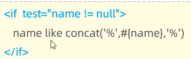
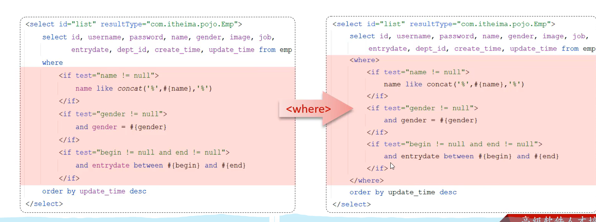
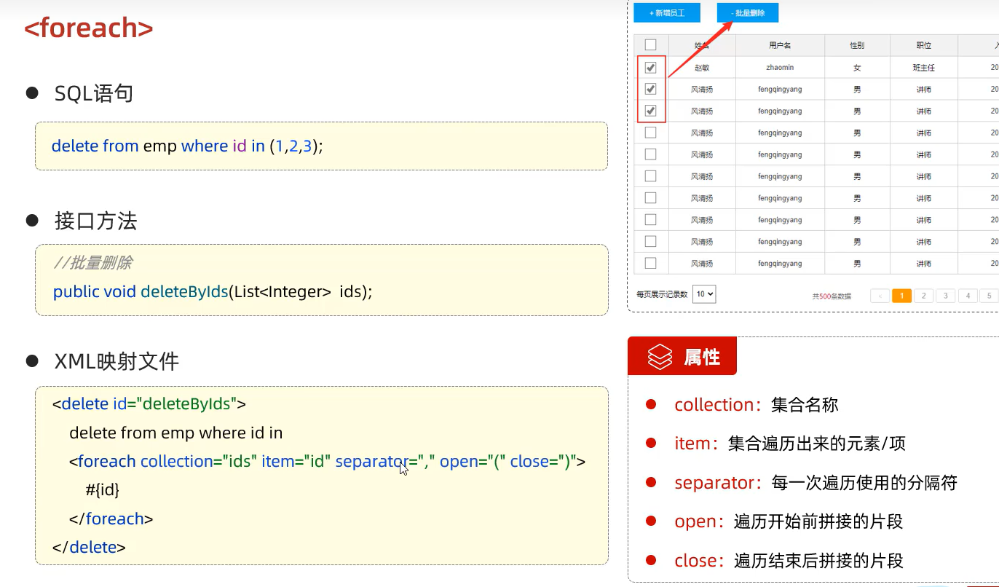

# 动态SQL

随着用户的输入或外部条件的变化而变化的SQL语句,我们称为SQL

## if
 < if>: 用于判断条件是否成立.使用test属性进行条件判断,如果条件为 true,这拼接 SQL

 

 ## where

 < where>: where元素只会在子元素有内容的情况下才插入where字句,而且会自动去除子句的开头的AND或or

 

 ## set

 < set>: 动态的在行首插入SET关键字,并会删掉额外的逗号.(用在update语句中)

 ## foreach

 

 