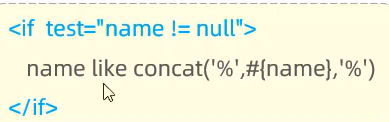
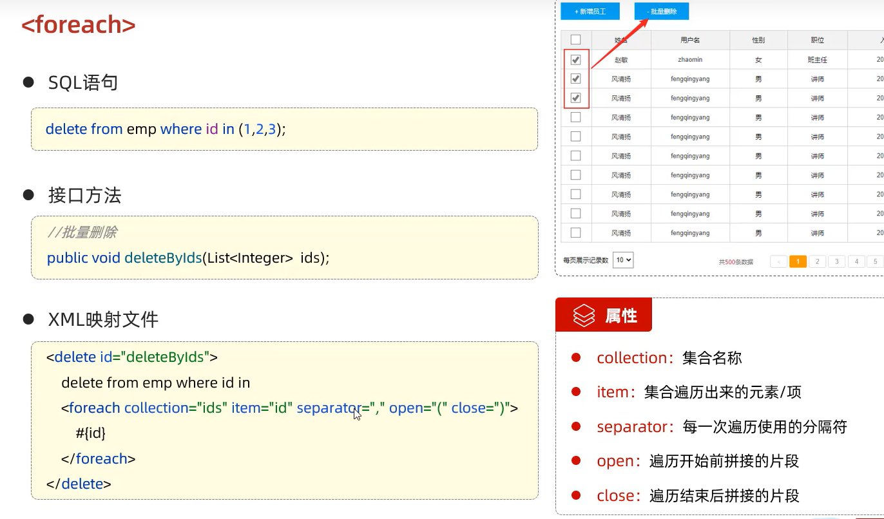

# 动态SQL

随着用户的输入或外部条件的变化而变化的SQL语句,我们称为动态SQL

## if
 < if>: 用于判断条件是否成立.使用test属性进行条件判断,如果条件为 true,则拼接 SQL

 

 ## where

 < where>: where元素只会在子元素有内容的情况下才插入where字句,而且会自动去除子句的开头的AND或or

 

 ## set

 < set>: 动态的在行首插入SET关键字,并会删掉额外的逗号.(用在update语句中)

 ```xml
   <update id="update">
        update tb_brand
        <set>
            <if test="brandName != null and brandName != ''">
                brand_name = #{brandName},
            </if>
            <if test="companyName != null and companyName != ''">
                company_name = #{companyName},
            </if>
            <if test=" ordered != null and  ordered != ''">
                ordered = #{ordered},
            </if>
            <if test="description != null and description != ''">
                description = #{description},
            </if>
            <if test="status != null">
                status = #{status}
            </if>
        </set>  
        where id = #{id};
    </update>
 ```

 ## foreach

 

## choose(when,otherwise)

选择类似于switch语句
 
```xml
<select id="selectByConditionSingle" resultMap="brandResultMap">
        select *
        from tb_brand
        where
            <choose>
                <when test="status != null">
                 status = #{status}
                </when>
                <when test="companyName != null and companyName != ''">/*相当于case*/
                    company_name like #{companyName}
                </when>
                <when test="brandName != null and brandName != ''">/*相当于case*/
                    brand_name like #{brandName}
                </when>
                <otherwise>/*相当于default*/
                    1 = 1 /* 或其他适合的默认条件 */
                </otherwise>
            </choose>
    </select>

```