**mybatis有注解和xml映射文件两种方式,注解用于执行简单的sql,xml映射文件用于执行复杂的sql语句**


# 根据主键删除

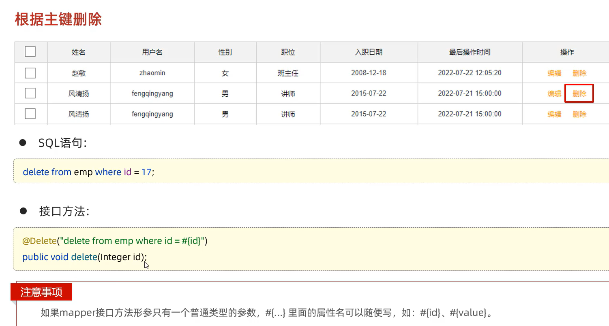

# 参数占位符

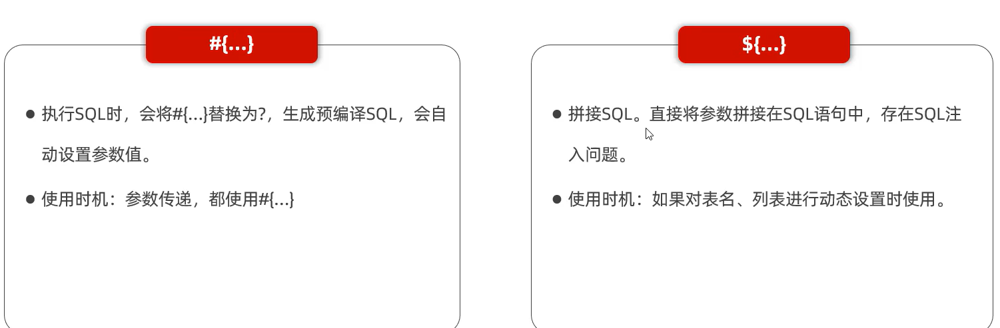

# 新增


* `#{}`:将其替换为 ? ,为了防止SQL注入
* `${}`:拼sql,存在sql注入的问题

参数传递的时候都用:`#{}`
表明或者列名不固定的情况下:`${}`

### 事务

MyBatis事务:
1. openSession():默认开启事务,进行增删改查后需要sqlSession.commit();手动提交事务

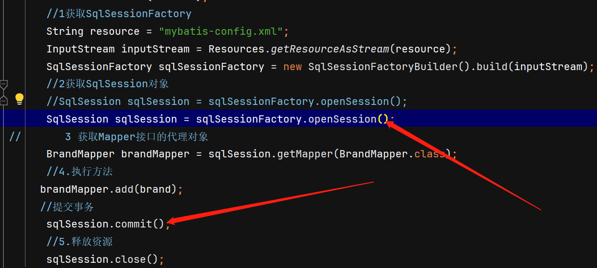

2. openSession(true):可以设置为自动提交事务(关闭事务)

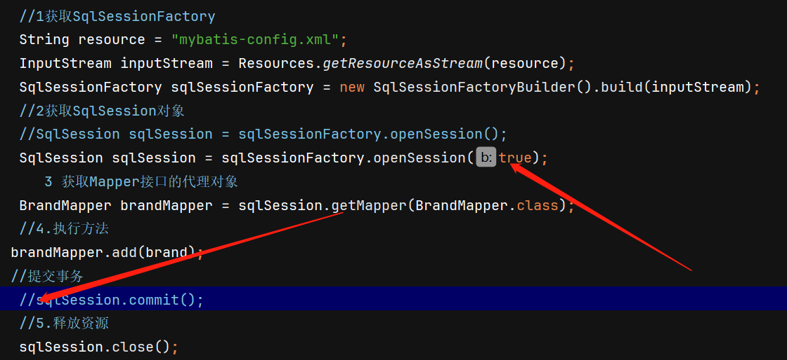

### 返回添加数据的主键

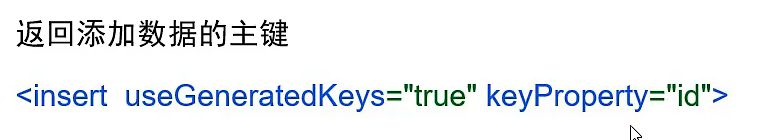


# 更新


# 查找

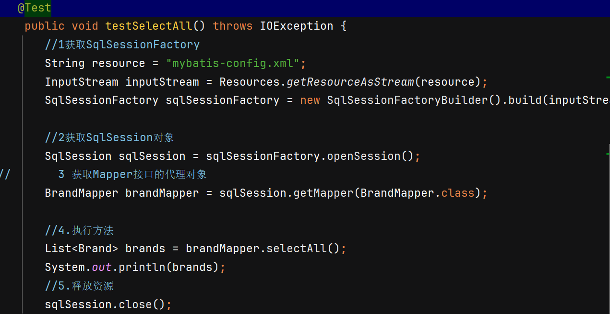

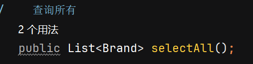

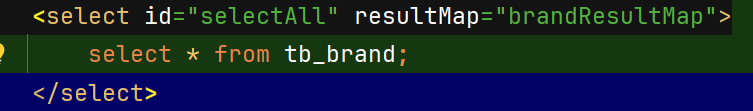

### 数据封装

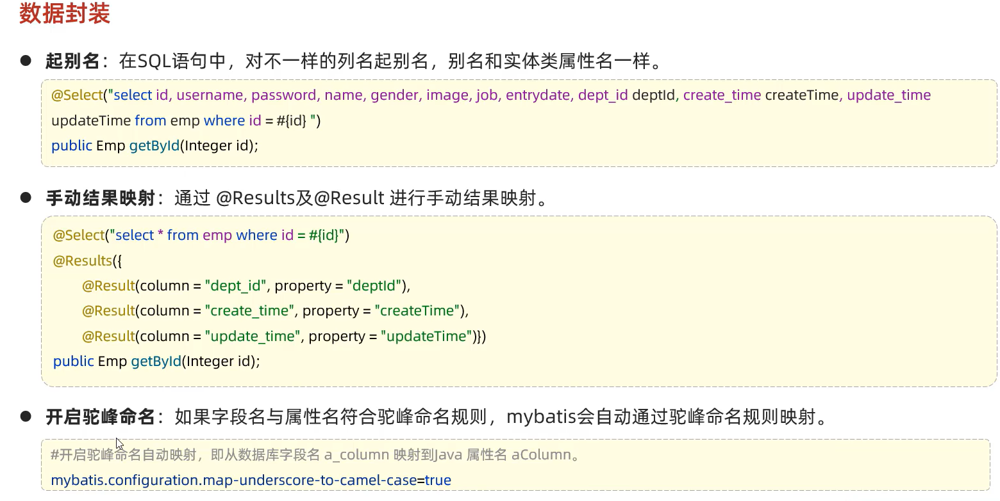

##### 起别名
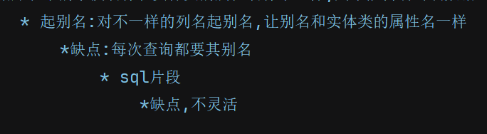
##### 用resultMap标签
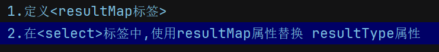

```xml
<resultMap id="brandResultMap" type = "brand">
        <!--
            id:完成主键字段的映射
                column:表的列名
                property:实体类的属性名
            result:完成一般字段的映射
                column:表的列名
                property:实体类的属性名
        -->
        <result column="brand_name" property="brandName" />
        <result column="company_name" property="companyName" />
    </resultMap>
    <select id="selectAll" resultMap="brandResultMap">
        select * from tb_brand;
    </select>
```


