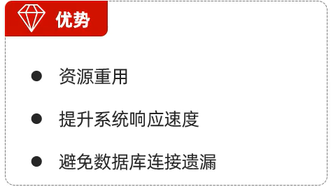
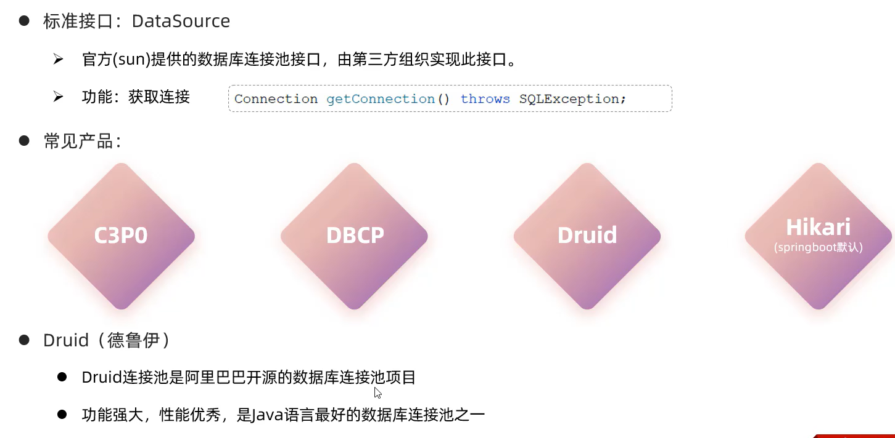
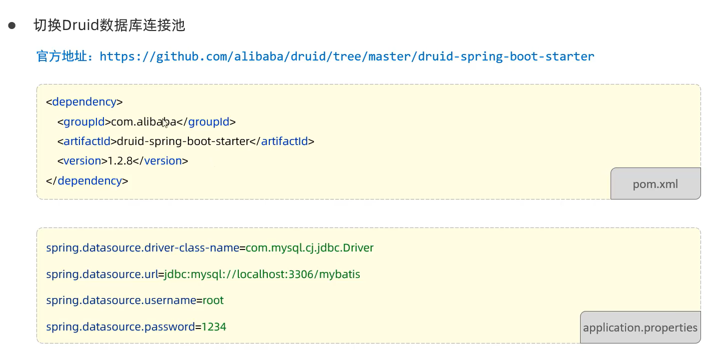
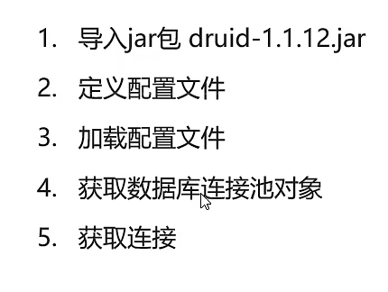

# 数据库连接池

* 数据库连接池是个容器,负责分配,管理数据库连接
* 他允许应用程序重复使用一个现有的数据库连接,而不是重新建立一个
* 释放空闲时间超过最大空闲时间的连接,来避免因为没有释放连接而引起的数据库连接遗漏



## 标准接口





# Driud使用



```
package com.Syhaun.druid;

import com.alibaba.druid.pool.DruidDataSourceFactory;

import javax.sql.DataSource;

import java.io.FileInputStream;
import java.io.FileNotFoundException;
import java.io.IOException;
import java.sql.Connection;
import java.util.Properties;

import static com.sun.tools.doclint.Entity.prop;

//Druid数据库连接池演示
public class DruidDemo {
    public static void main(String[] args) throws Exception {

//        导入jar包

//        定义配置文件

//        加载配置文件
        Properties prop = new Properties();
        prop.load(new FileInputStream("D:\\代码文件夹集\\IDEA\\tc\\JDBC\\jdbcdemo\\src\\druid.properties"));
//        获取连接池对象
        DataSource dataSource = DruidDataSourceFactory.createDataSource(prop);
//        获取数据库连接Connecton
        Connection connection = dataSource.getConnection();
        System.out.println(connection);
    }

}
```