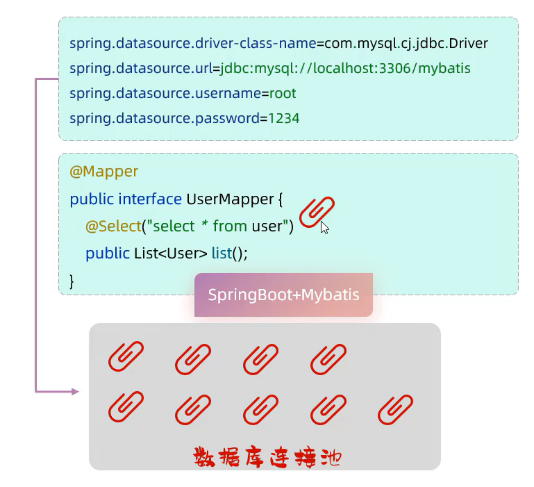
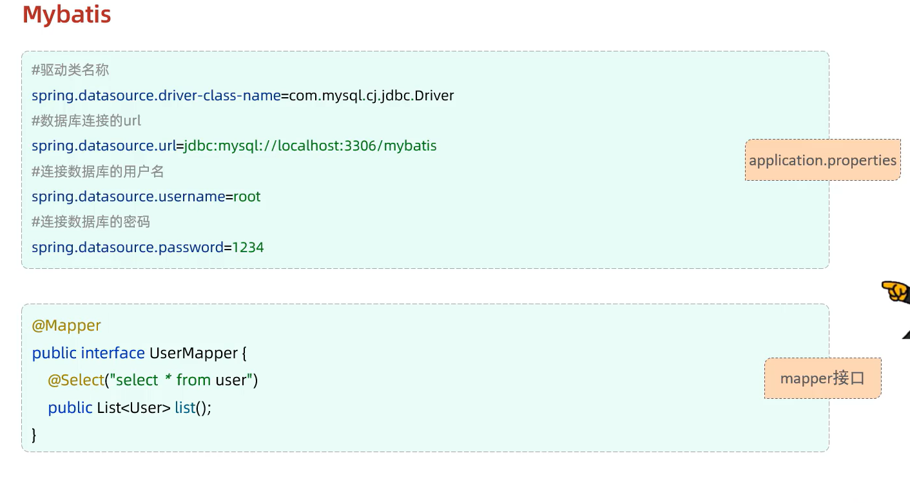
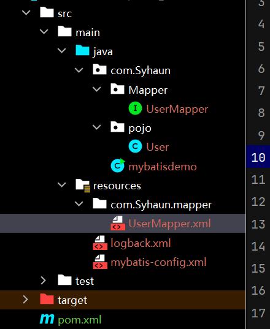
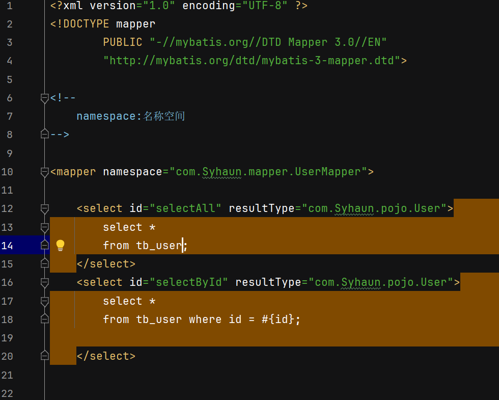
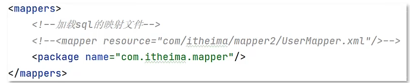

# 概述
Mybatis 是一层优秀的持久层框架,用于简化JDBC开发

## 持久层
* 负责将数据保存到数据库的那一层代码
* javaEE三层架构:表现层,业务层,持久层

## 框架
* 框架就是一个半成品软件,是一套可重用,通用的,软件基础代码模型
* 在框架的基础之上构建软件编写更加高效,规范,通用,可扩展.

# mapper代理

目的    
* 解决原生方式中的硬编码
* 简化后期执行SQL

要求
* 定义与SQL映射文件同名的Mapper接口,并且将Mapper接口和SQL映射文件放在同一目录下

* 设置SQL映射文件的namespace属性为Mapper接口全限定名

* 在Mapper接口中定义方法,方法名就是SQL映射文件中sql语句的id,并保持参数返回类型和返回值类型一致
* 编码
  * 通过SqlSession的getMapper方法获取Mapper接口的代理对象
  * 调用对用方法完成sql的执行

细节:如果Mapper接口名称和Sql映射文件名称相同,并且在同一目录下,则可以使用包扫描的方法简化SQL映射文件的加载  在mybatis的配置文件中
