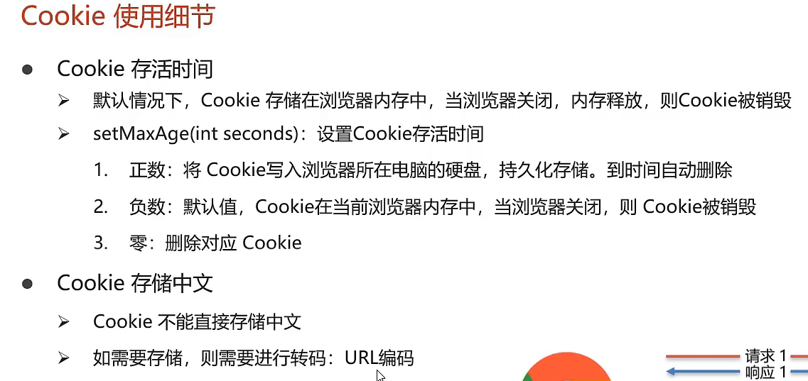

# Cookie
Cookie:客户端会话技术,将数据保存到客户端,以后每次请求都携带Cookie数据进行访问

## Cookie基本使用

1. 发送Cookie
   1. 创建Cookie对象,设置数据 
    `Cookie cookie = new Cookie("key","value");`
    2. 发送Cookie到客户端:使用response对象
     `response.addCookie(cookie);`
2. 获取Cookie
   1. 获取客户端携带的所有Cookie,使用request对象
   `Cookie[] cookies = request.getCookies();`
   2. 遍历数组,获取每一个Cookie对象:for
   3. 使用Cookie对象获取方法
   `cookie.getName();`
   `cookie.getValue;` 

