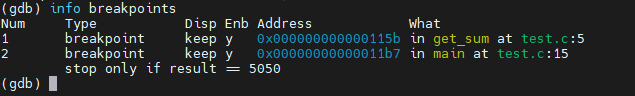

# 启动和退出gdb

只有在编译器gcc编译时加入 `-g` 选项才可以使用gdb进行调试

`gcc -g test.c -o test`


结束调试时,使用 `quit` 返回Linux提示符

# 显示和查找程序源代码

`list`:显示10行代码.再次运行显示接下来10行

`list 5, 10`:显示第5-10行的代码

`list test.c:5,10`:显示源文件test.c的第5-10行代码,用于调试含有多个文件的程序

`list get_sum`:显示get_sum函数周围的代码


##### 在调试过程中运行linux命令

`(gdb) shell ls`


search/forward s:查找从当前行向后的第一个匹配的字符串s

`reverse-search s`:向前

# 执行程序和获取帮助

`run` 程序开始执行

`continue` 暂停后继续执行
`next` 执行下一条语句

```bash
(gbd)help list
(gdb)help all
```
列出list命令的帮助信息,列出gdb所有命令的帮助信息

# 设置和管理断点

`break 5`:在第五行设置断点

`break temp`:在函数temp开始处设置断点

`break 行号/函数名 if 条件` :符合条件时,程序暂停

`watch 表达式` :当表达式中的值发生改变的时候,程序暂停

`info breakpoints`查看当前设置的中断点



Num列表示断点的编号;Type表明列表中项目的类型;Disp列表面断点是否生效一次后失去作用,是就为dis,不是为keep;Enb表示当前中断点是否有效,y有效,n无效;Address表示中断点在程序中的逻辑地址;what指明中断发生在哪个函数的第几行

`disable n`:使第n个中断点失效

`enable n`:使第n个中断点重新有效
##### 删除断点


# 查看和设置变量的值

```bash
print 变量或者表达式;
print 变量=值;  //对变量进行赋值
print 表达式@要打印的值的个数n;   //打印以表达式值开始的n个数
```

`whatis 变量或表达式`:显示变量或者表达式值的数据类型

`set 变量=值` 给变量赋值 和`print i=300`效果相同

# 控制程序的执行

continue 继续运行

kill 结束调试

next和step 都是单步执行源代码语句

区别: 遇到函数调用,next当作一条语句来执行,step会跟踪进入被调用的函数

nexti和stepi单步执行一条机械指令

