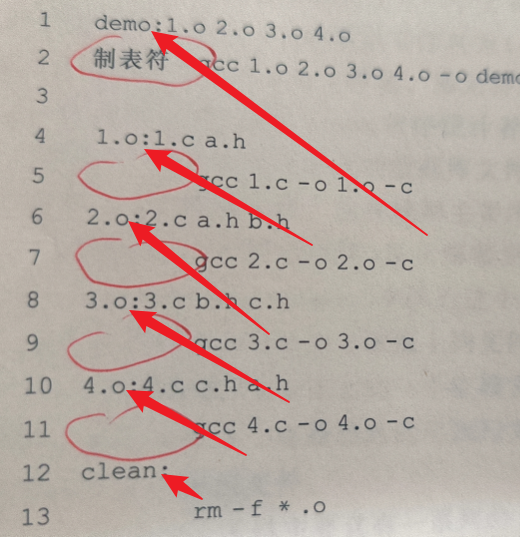

# make 和 Makefile

make工具根据Makefile文件中定义的规则自动执行编译工作,适用于项目

### make命令

`make [选项] [make 工程文件]`

-d : 显示调试信息
-f : 使用指定文件为依赖关系文件
-n : 不执行Makefile中的命令,只i想拉屎输出这些命令
-s : 执行但不显示任何信息

### Makfile文件

一个Makefile文件主要包含一系列的make规则

```
目标文件列表:依赖文件列表
<TAB>命令列表
```

目标文件列表:make最终创建的文件,空格分隔,也可以是要执行的动作

依赖文件列表:编译目标文件所需要的其他文件

命令列表:make执行的动作.,每个命令一行,且起始字符必须为TAB字符(制表符)


一般情况下:make的工作目录就是当前目录,target就是需要创建的二进制文件或者目标文件.dependency是在创建target时需要用到的一个或多个文件的列表.命令序列就是创建target文件所需要执行的步骤,常为编译命令.


直接make 默认生成第一个目标文件
`make target`

箭头所指的为target
eg:`make 3.o` `make demo`