# vim 的模式

## 创建加密文档
`vim -x file1`

### 普通模式

vim打开后默认的模式就是普通方式

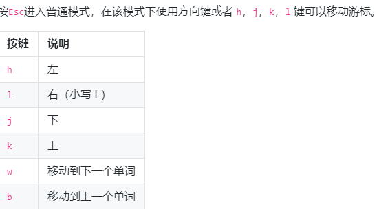

一般按 *i* 或者 *a* 进入 插入模式

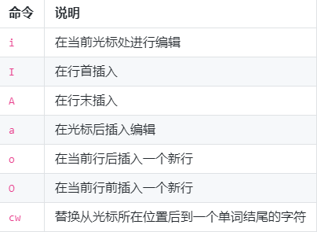

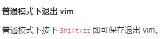

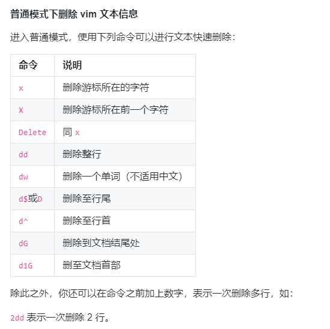

普通模式下 `.`可以用作重复上一次的命令的操作

`N+命令`,表示该命令重复执行N次

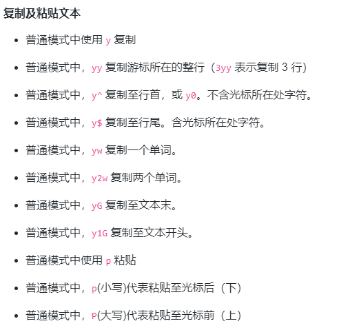

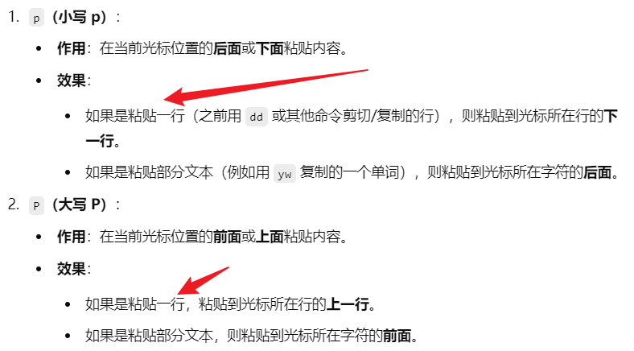

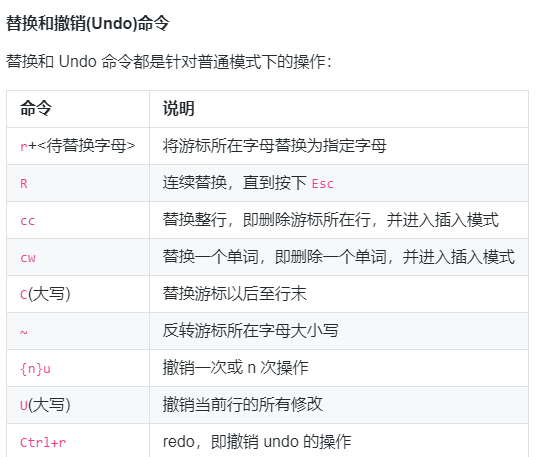

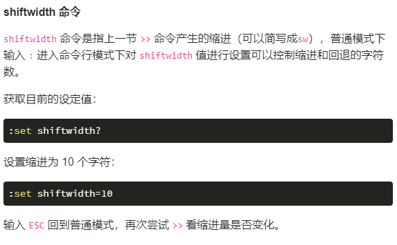

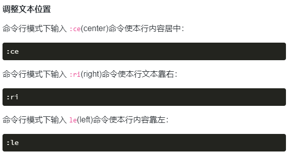

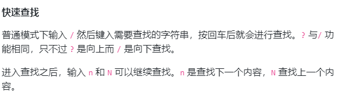

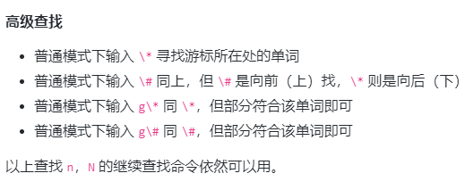

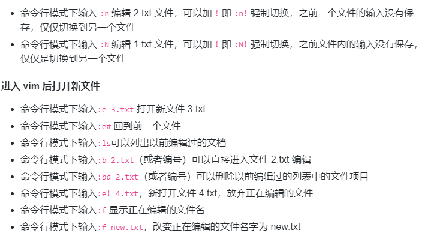

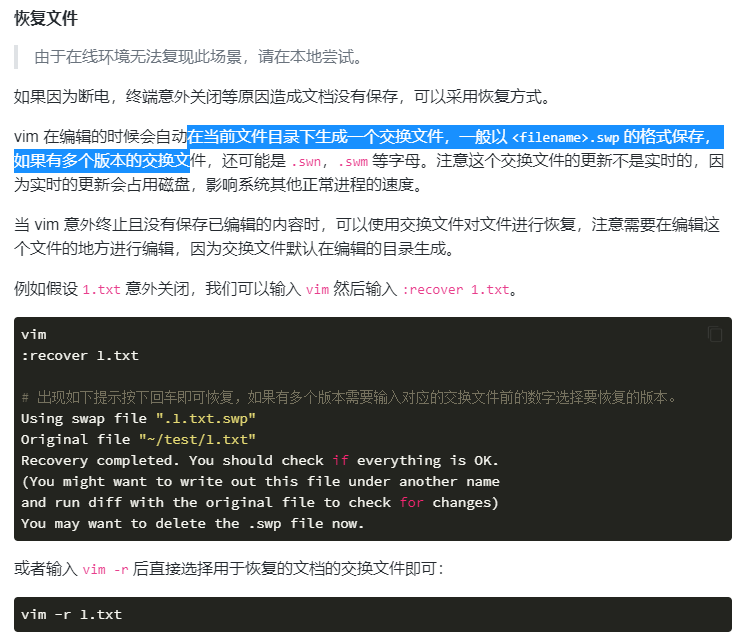

### 插入模式

插入文本,按 *ESC*返回普通模式

### 命令模式

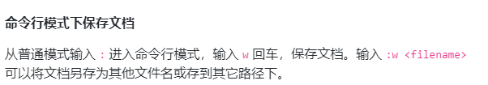

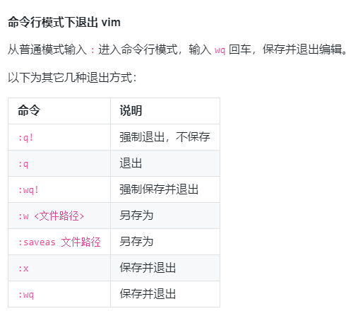

### 可视模式

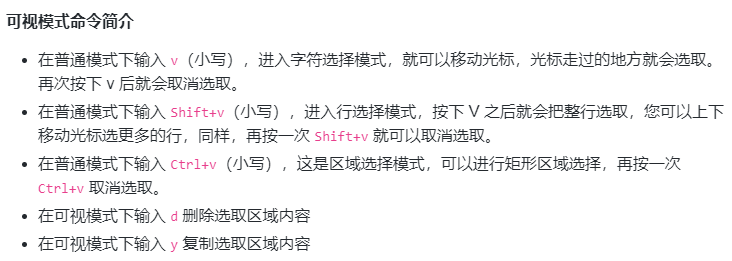

# 视窗操作

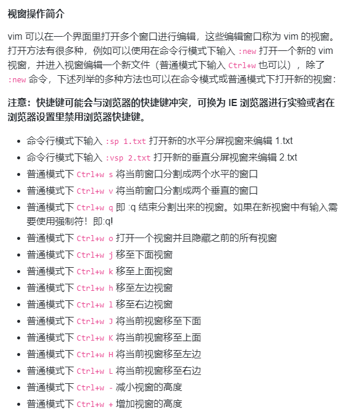

### 在vim执行外部命令

`:!ls`:用于显示当前目录的内容
`!rm FILENAME`:用于删除名为FILENAME的文件
`:w FILENAME`:将当前vim中正在编辑的文件另存为FILENAME文件 

### vim的功能设定

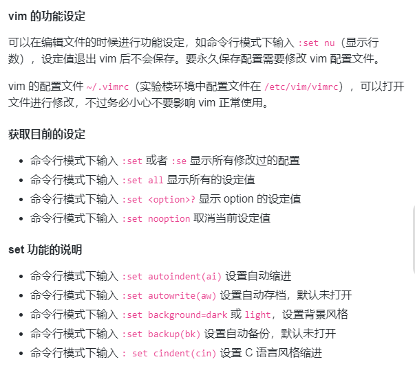

