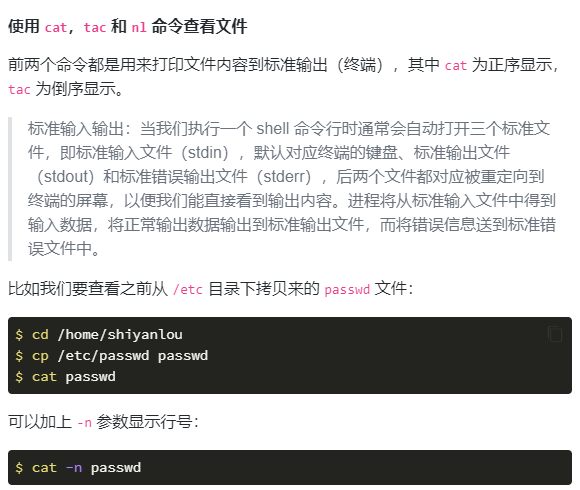
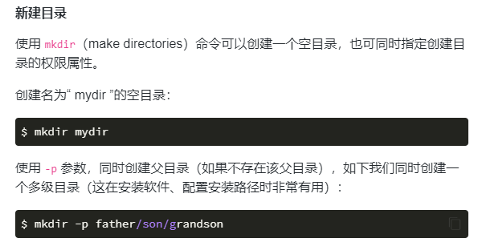
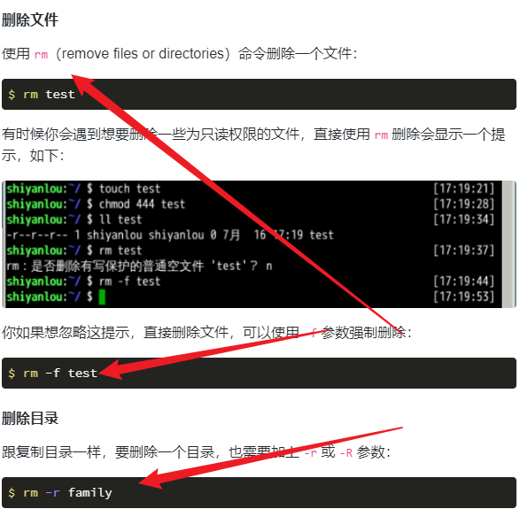
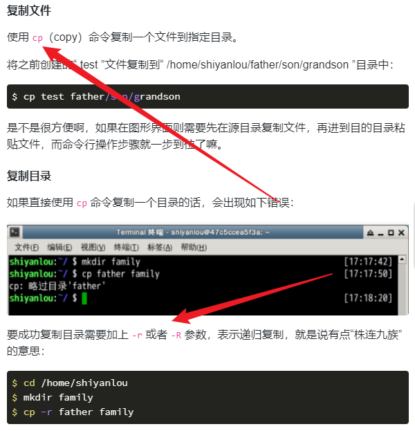
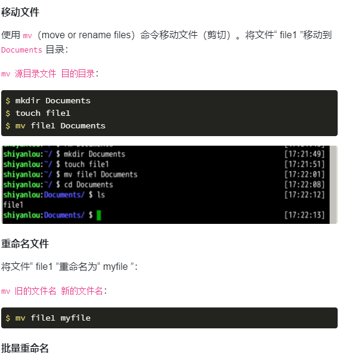
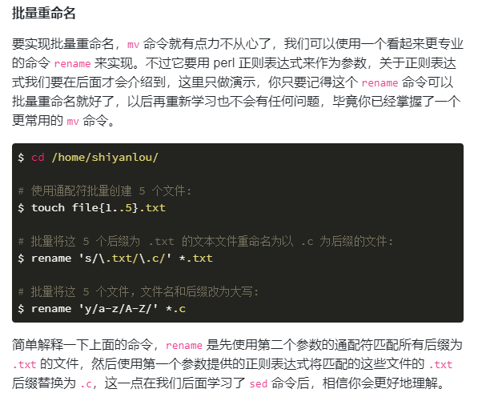
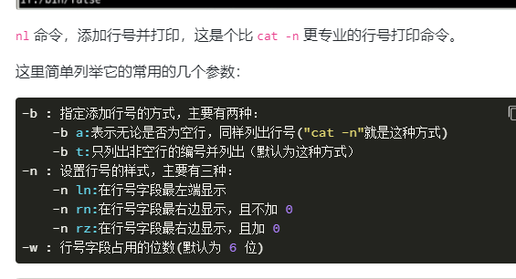
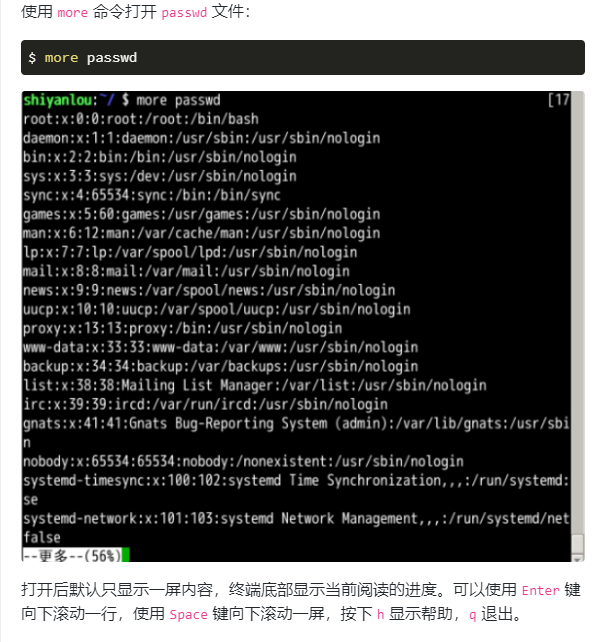
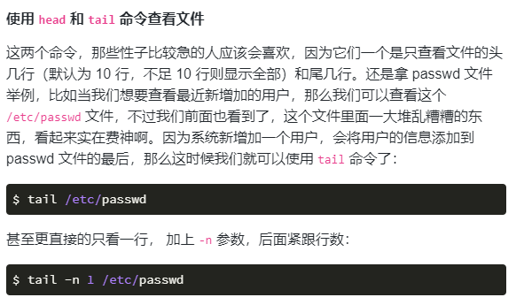
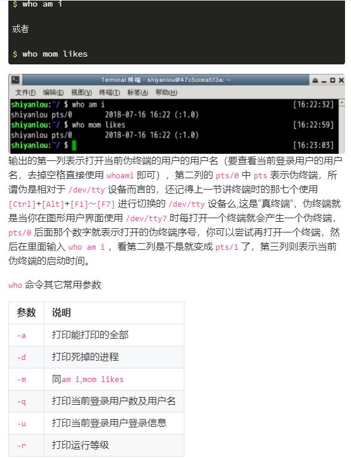

1. ls 列出当前目录
2. pwd 打印当前工作目录的完整路径名
3. touch 将每个文件的访问和修改时间更新为当前时间
4. cat 将FILE或标准输入连接到标准输出

5. mkdir 如果目录不存在,则创建目录

6. cd 切换当前目录至指定目录
7. rm 删除

8. copy 将文件1中的内容复制到文件2中,文件本身的名称不会更改
9.  which 在PATH变量指定的路径中,搜索某个系统命令的位置,并且返回第一个搜索结果.
10.  cp

11.  mv

12. nl

13. more less

14. head tail

15. who
