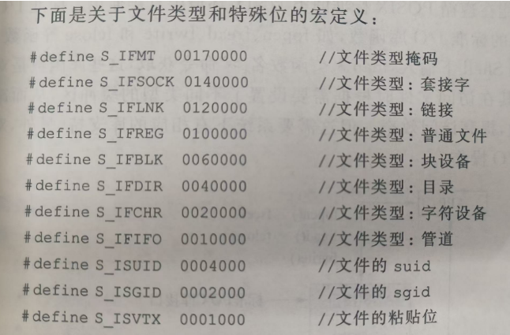

# 文件系统概述
#### 文件结构

文件包含本身所包含的数据外还包含文件的属性


1. /:根目录
2. /bin:普通用户可执行的命令,任何用户都可以执行该目录的命令
3. /boot:系统内核启动需要的文件
4. /home:用户的主目录.每个用户都有一个自己的目录,在该目录下
5. /root:超级权限者用户的主目录
6. /lib:用户存放各种库文件
7. /etc:系统中的配置文件
8. /usr:应用目录(类似windows的program files)
    * /usr/bin:系统使用的应用程序
    * /usr/sbin:root用户使用的高级管理程序和系统守护程序
    * /usr/src:系统内核源代码
9. /var:缓存或者运行产生的文件
10. /dev:外设
11. /tmp:临时文件
12. /run:临时文件系统,存放系统启动以来的信息,系统重启就会别清清除

##### 文件系统模型


1. 通过设备驱动本身的接口直接访问物理磁盘.(不稳定)
2. 通过虚拟文件系统直接读写文件上的内容,只存在于内存不存在于磁盘

#### 目录,索引结点和文件描述符

文件控制块(FCB):为对一个文件进行正确的读写,用于为文件设置描述和控制文件的数据结构.

文件目录:FCB的有序集合

目录文件:将文件目录以文件的形式保存在外存上的文件

FCB的三类信息
1. 基本信息,如文件名,文件物理位置,文件逻辑结构和文件物理结构
2. 控制信息,如文件的所有者存取权限,所有者所在组的存取权限,其他用户的存取权限
3. 信息类,如文件建立日期和时间,文件上一次修改日期和时间,当前使用信息项

索引结点(inode):数据块,包含文件创建.修改日期,文件访问权限,文件在磁盘上的存放位置等信息.文件系统给每个inode分配一个号码,称为索引结点编号

linux将FCB(内核中dentry结构体)组织为`文件名,索引结点编号`的结构

文件描述符:文件描述符是一个非负整数,用于表示打开的文件、设备、管道或网络连接等资源。当程序通过系统调用如 open()、socket() 等打开文件或其他资源时，操作系统为该资源 分配一个文件描述符。

#### 文件的分类

1. 普通文件
2. 目录文件
3. 字符特殊文件:表示系统字符类型的设备,如键盘鼠标等
4. 块特殊文件:表述系统中块类型的设备,如硬盘,光驱等
5. FIFO:用于进程间的通信,也称命名管道
6. 套接字(socket):主要用于网络通信,也可用于一台主机上的进程之间的通信
7. 符号链接:指向另一个文件,是另一个文件的引用.

`ls -l`:查看文件类型


最左边第一项第一个字母是文件类型的缩写
|字符|含义|
|---|---|
|-  (regular)|普通文件|
|d (directory)|  目录文件
|c (character)|  字符设备文件
|b (block)|  块设备文件
|p (pipe)  |    管道文件(命名管道)
|s (socket) |    套接字文件
|l (link)|      链接文件

#### 文件访问权限控制


输出结果依次为:文件类型+访问权限,连接数,文件所有者,文件所有者所在组,文件大小(字节),文件创建时间,文件命.

第一项共10位,第一位为文件类型.剩下9位3位一组.分别表示不同用户对该文件的操作权限,r可读,w可写,x可执行
1. 文件所有者
2. 文件所有者同组用户
3. 其他用户

`chmod 666 test.c`: 对文件访问权限进行修改

对于三种对应3个值分别为:
r=4,w=2,x=1

##### st_mode结构

文件的类型与访问权限被定义在st_mode的内核数据结构中,实质上是一个无符号16位短整型数


1. st_mode[0:8]:对应用户的权限 8-6所有者 5-3是同组者 2-0是其他用户
2. st_mode[12:15]:用作文件类型,最多可标识16中,现已用7中
3. st_mode[9:11]:文件的特殊属性,1表示有,0表示没,分别为suid,sgid,sticky

st_mode[10]和st_mode[11]分别设置suid和sgid

suid为1 任何用户执行该文件时均获得该文件所有者的临时授权,有效UID等于该文件所有者的UID
sgid为1 任何用户执行该文件时均获得该目录所属组成员临时授权,有效UID等于该目录所属组成员的UID

这种机制适用于让普通用户运行只有root用户才能使用的程序或者命令


s出现在文件所有者执行权限位上,说明suid位置为1;若s出现在用户组执行权限位上,说明sgid为1.若t出现在其他组的x位上,说明sticky为1.sticky(只对目录有效)在当前用户有该目录的写权限,只用于该用户删除本目录下属于自己的文件.

suid,sgid和sticky可通过chmod命令实现,在表示读写执行权限前加上者三个权限的表示数字之和

suid=4,sgid=2,sticky=1

`chmod 7666 test.c`




表示将文件权限的suid,sgid,sticky都置为1

# 文件的读写

1. 直接I/O系统调用
2. 标准I/O库函数

#### 文件打开创建和关闭

##### open系统调用

```c
int open(const char * pathname/*路径*/,int flag/*标志*/);
int open(const char * pathname,int flag,mode_t mode/*八进制st_mode*/);
```
`open系统调用`:打开或创建文件,返回一个文件描述符,其他函数通过文件描述符进行读写操作

可打开普通文件,块设备文件,字符设备文件,链接文件和管道文件,但是仅可以用来创建普通文件

成功调用返回一个文件描述符,有错误返回-1,错误代码赋给errno

##### creat系统调用

```c
int creat(const char * pathname,mode_t mode);
```

`creat系统调用`:creat只能以只写的方式开发创建的文件,无法创建设备文件

成功调用返回一个文件描述符,有错误返回-1,错误代码赋给errno

##### close系统调用

```c
int close(int fd/*要关闭的文件描述符*/);
```
`close系统调用`;用于关闭一个已经打开的文件.

#### 文件的读写

##### read系统调用

```c
ssize_t read(int fd,void * buf,size_t count)
//参数2:指向存放读到的数据的缓冲区
//参数3:从文件fd种读取的字节数
```
`read系统调用`:read函数从文件描述符fd所指向的文件种读取count个字节的数据到buf指向的缓冲区中.

返回值是实际读取到的字节数,有错误返回-1,错误代码赋给errno.count为0则不读数据,返回0,

##### write系统调用

```c
ssize_t write(int fd,void * buf,size_t count);
```

`write系统调用`:write函数将buf所指向的缓冲区中的count个字节数据写入到由文件描述符fd所指示的文件中

调用成功返回写入的字节数.


**read和write实际读写的字节数通过返回值判断,参数count只是一个期望值.读写操作会对内核中表示文件偏移位置的f_pos起作用,文件的偏移量会加上实际读写的字节数**

##### fcntl系统调用

```c
int fcntl(int fd,int cmd);
int fcntl(int fd,int cmd,long arg);
int fcntl(int fd,int cmd,struct flock * lock);
//cmd,控制命名字,后面的参数根据命令字走
```

`fcntl系统调用`:用于对已打开的文件描述符进行各种控制操作来实现已打开文件的各种属性(读,写,追加,非阻塞)

成功返回0,失败返回1;

#### 文件读写指针的移动

文件的读写指针是文件"当前文件偏移量",通常是一个非整数,以读写方式打开文件的时候,文件读写指针指向文件的起始处,读写操作从当前文件读写指针位置开始,使文件读写指针的位置增加所读写的字节数.

##### lseek系统调用

```c
off_t lseek(int fd,off_t offset,int whence);
//参数2:新偏移量位置相对基准点的偏移
//参数3:文件开头当前位置或者末尾
```

`lseek调用`:lseek函数用来修改文件的读写指针位置,可以支持文件的随机读写.

调用成功返回新的文件的偏移量,仅对普通文件生效

#### 标准I/O的文件流

标准I/O库中,每个被访问的文件和一个叫做流(stream)的指针关联,在c语言中流的类型是FILE的指针.

##### fopen函数

```c
FIlE * fopen(const char * path,const char * mode);
//参数2:打开文件的方式
```
##### fclose函数

```c
int * fclose(FILE * fp);
```

返回0成功,返回EOF失败

##### fileno函数

```c
int fileno(FILE * stream);
```
fileno函数从FILE类型的结构体中获取文件描述符,执行成功后,返回一个文件描述符.>-1成功(文件描述符),-1(失败).

##### fdopen函数

```c
FILE * fdopen(int fd,char * mode);
```
fdopen函数会返回一个与参数fd所值文件相关联的文件流指针(FILE*).

返回非NULL成功,返回NULL失败

# 文件属性及相关系统调用

#### 获取文件属性

```c
int stat(const char *path,struct stat *buf);
int fatst(int fd,struct stat *buf);
int lstst(const char *path,struct stat *buf);
//参数buf:文件属性结构体
//0成功,NULL失败
```

stat用于获取file_name指定的文件名的状态信息,将信息保存到参数buf中

fstat区别于stat是用文件描述符来指定文件

lstat区别于stat,对于符号链接文件,前者返回符号链接文件本身的状态信息,后者返回符号链接文件指向的文件信息.

#### 修改文件的访问权限

```c
int chmod(const char *path,mode_t mode);
int fchmod(int fd,mode_t mode);
//成功返回0,失败返回1
```
