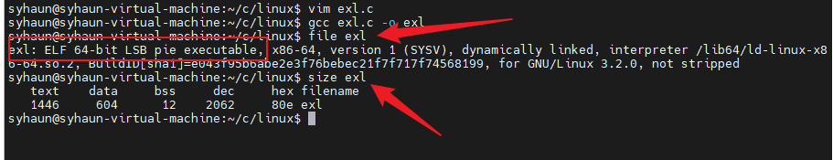
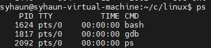
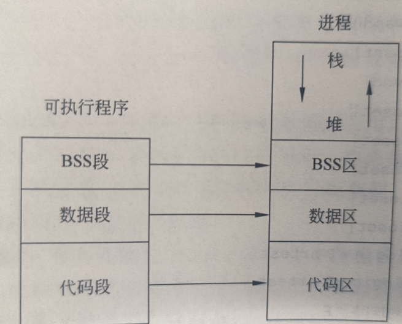
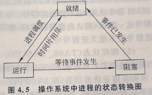
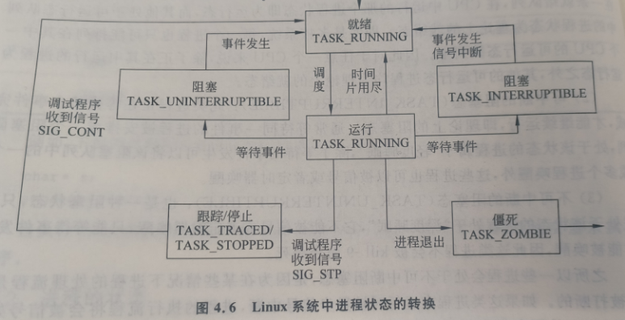
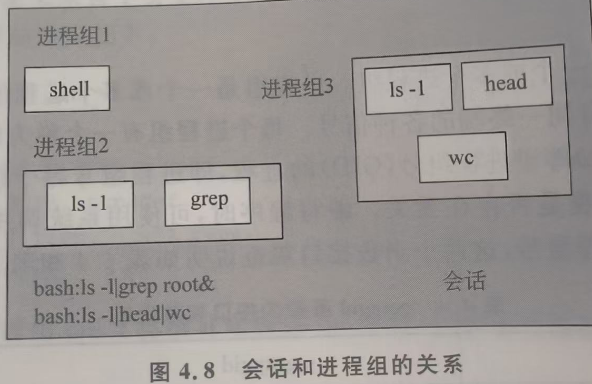
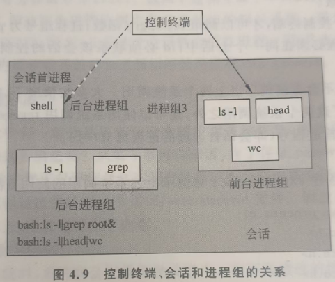
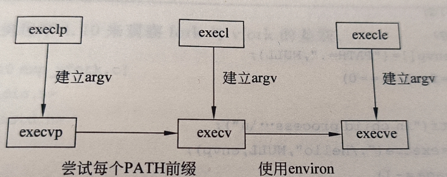
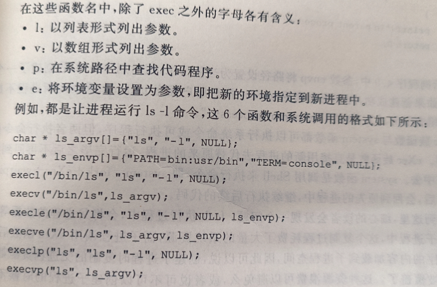

# linux 可执行程序的存储结构与进程结构

### linux可执行程序的存储结构

linux中可执行文件的格式为`ElF`,可以使用`file`或者`readelf`命令来查看文件的情况.`size`命令查看可执行文件中各段的大小.



size命令输出结构:dec总 hex 16进制
可执行文件由3段组成
1. 代码段(text):放程序的二进制代码,是CPU唯一能执行的机械指令.通常是只读的,共享的.此外,还规划了局部变量的相关信息.
代码段的机械指令包括操作码和操作对象(或对象地址引用).操作对象是立即数(具体的数值),那么直接包含在代码中,如果局部数据,运行局部数据的函数,系统将局部变量在栈区分配空间,使用数据时,通过引用数据地址的方式读.
2. 全局初始化数据区/静态数据区(data):数据段,存储被初始化的全局变量,已初始化的静态变量(包括全局静态变量和局部静态变量)和常量数据(字符串常量),静态内存分配区.
3. 未初始化数据区(bss):BSS段.保存全局未初始化变量和未初始化静态变量,值未0或空.
在程序文件中未分配空间,仅使用一部分记录大小和属性,加载到进程中分配空间并将数据化进行初始化未0或空.

### 程序的进程结构

进程源于程序,是程序的一次执行过程,当可执行程序被运行时,操作系统将可执行程序读入内存,依据程序的内容创建一个进程.`ps`命令查看进程的情况

ps命令输出结果:
* 第一列为PID号(非负整数),进程ID号或进程号,每个进程都有一个唯一的进程号标识
* 第二列为USER,创建该进程的用户
* 第三列为COMMAND即与该进程对应的可执行程序名称

进程一般分为5个部分
1. 代码区:存放进程执行的代码,在程序运行前已确定
2. 数据区:存放已初始化全局变量和静态变量,在程序运行前已确定
3. BSS区:存放未初始化的全局变量和静态变量,在程序运行前已确定
4. 堆区(heap):进程运行过程中可被动态分配的内存段,大小不固定,可动态扩张或缩减.程序中使用malloc等函数动态分配的内存属于堆区,不需要时调用free函数将内存释放
5. 栈区(stack):栈区内存由操作系统自动分配,用于存放进程临时创建的局部变量,函数调用时的参数返回值等,函数调用结束后,释放.


### 进程树

linux中除第一个进程时"手工"建立外,其余进程使用系统调用fork创建,被创建的进程称为子进程,调用fork的进程称为父进程.内核进程使用进程ID号标识每一个进程.一个进程除了有一个PID外,还有一个PPID存储父进程的PID
`pstree`查看进程树

# 进程的环境和进程属性

### 进程的环境

进程运行中,常使用创建进程时所设置的命令行参数
Linux中命令大多数由c语言编写
从主函数开始执行,要求main函数接受命令行参数,带参数的主函数原型为
```c
int main(int argc,char *argv[],char *envp);
int main(int arfc,char *argc[]);
//argv 命令行参数的个数
//argv 指向每个参数的指针所组成的数组
```
命令行中未设置环境变量,使用默认的环境变量值
`envp`记录了程序运行时的环境变量.环境变量`environ`是一个全局变量,存放在所有的Shell中,登录时就有了相应系统定义的环境变量.linux的环境变量有继承性,子进程继承父进程的环境变量.环境变量是一个指针数组,记录程序运行有关的系统数据(默认路径,Shell类型等)

##### 获取环境变量的值

shell中`env`,`set'命令查看当前环境变量

c语言中getenv函数
```c
char *getenv(const char (name));
```

### 进程的状态

理论上
1. 运行态
2. 就绪态
3. 阻塞态


实际上
1. 可运行态
2. 可中断的阻塞态
3. 不可中断的阻塞态
4. 僵死状态
5. 跟踪状态
6. 停止状态

 

 ### 进程的基本属性

进程控制块(PCB块):一个`task_struct`类型的结构体,记录进程的各种信息.


##### 进程号和父进程号

PID号是系统维护的一个非负整数,在创建进程时确定,无法在用户层修改.

使用`getpid()`函数获得PID
```c
pid_t getpid();
//成功返回进程号,失败返回-1
```

使用`getppid()`获取父进程号
```c
pid_t getppid();
//成功返回父进程号,失败返回-1
```

##### 进程组号

进程组:一个或多个进程的集合,通常和作业相关联,接受来自同一终端的跟各种信息.每个进程都属于一个或多个进程组.每个进程组有个称为组长的进程,组长进程的PID等于进程组号(GID).

`getpgid`获取进程组号,`setpgid`设置进程组号.

```c
pid_t getpgid(pid_t pid);
```
```c
pid_t setpgid(pid_t pid,pid_t pgid);
//pid:进程PID号,pgid待设置的进程组号
```
将进程号为pid的进程的进程组号设置为pgid.

当pid为0,标识设置当前进程的进程组号

当pgid为0,pid进程的进程组号设置为自己的进程号,即pid进程成为进程组的组长

##### 会话

会话:一个或多个进程组的集合,每个会话有唯一会话首进程,会话号等于会话首进程号.

一般情况,用户登录后所执行的所有程序都属于一个会话,登录的Shell是会话首进程,Shell所使用的终端就是会话的控制终端.


`getsid`获取会话ID,`setsid`创建新会话

```c
pid_t getsid(pid_t pid);
//pid为0时表示获取当前进程的会话号
```
```c
pid_t setsid(void);
```
调用setsid函数的进程不能是进程组长.

非组长进程调用setsid,创建一个新会话,该进程加入这个新会话并成为这个会话的首进程以及新进程组的组长

### 控制终端

会话首进程打开一个控制终端,该终端成为此会话的控制终端.会话和控制终端是一一对应的关系.与
控制终端连接的会话首进程称为控制进程.当前与终端交互的进程所在的进程组称作前台进程组,其余进程组称为后台进程组.


系统调用`tcgetpgrp`和`tcsetpgrp`获取或设置与终端连接的前端进程组.

```c
pid_t tcgetpgrp(int fd);
//指定控制终端对应的文件描述符
```
```c
pid_t tcsetpgrp(int fd,pid_t pgrp);
//指定控制终端对应的文件描述符
//待设置为前台的进程组的组ID号
```
使用`tcgetpgrp`时,参数fd必须时调用`tcgetpgrp`进程的控制终端

进程要有一个控制终端,才能调用`tcsetpgrp`函数,进程组号为pgrp的进程组和调用`tcsetpgrp`的进程必须在同一会话中,fd必须联系该会话的控制终端,负责调用失败


### 进程的用户属性

* 真实用户号(RUID):用户在登录系统时,系统记录该登录用户.不做修改的情况下,随后建立的进程真实用户均为登录用户.进程在创建时,会记录创建者的ID号作为真实用户号

```c
uid_t getuid(void);
//获取进程真实用户号
```
* 进程有效用户号(EUID):大多数情况有效用户号和真实用户号相同.
```c
uid_t geteuid(void);
//获取进程的有效用户号
```
* 保存的设置用户号(REUID):当进程的真实用户号和有效用户号不同时,进程拥有有效用户所具有的权限.使用`setuid`和`seteuid`系统调用修改有效用户号,后者只对有效用户号进行修改,前者根据进程的真实用户来修改用户号.
* 进程用户组号(GID),进程有效用户组号和保存的进程用户号:针对用户的内容同样使用于各个组ID,可使用系统调用`getgid`和`getegid`来获取真实组号和有效组号
`uid_t getgid(void);uid_t getegid(void);`

# 进程管理

进程管理包括创建进程,执行进程,进程退出等操作.

### fork创建进程

```c
pit_t fork(void);
//成功后父进程返回创建的子进程的进程号;子进程中返回0
```

用户调用`fork`后,fork调用内核的fork代码,完成以下工作
1. 为子进程分配新的内存块和内核数据结构
2. 复制父进程的信息到子进程空间中(数据区,堆栈,一些属性)
3. 向运行进程组中添加新的进程
4. 将控制返回给父子两个进程

### 在进程中运行新代码(eXec)

eXec族函数以新的进程代码去代替原来的进程代码,但进程的PID保持不变.

```c
int execvp(char * file, char *argv[]);
//参数1:待运行的程序
//参数2:执行file所需要的参数(以NULL结尾)
//返回-1失败,无返回值成功.
```

`execvp`函数执行过程为:当用户调用后,内核按照程序名,将程序的内容加载到用户空间,同时将参数表argv复制进到进程中,最后内核调用新加载的程序的main


只有`execve`是系统调用,其他5个都是库函数,最终调用`execve`



无论是列表还是数组形式,参数结束以NULL表示.

### vfork函数

```c
pid_t vfork(void);
```
`vfork`和`fork`函数一样,调用成功后创建一个子进程.与`fork`不同的是:创建的子进程在调试eXex或exit之前将在父进程的地址空间中运行,而父进程在这段时间处于不可中断阻塞状态.

`vfork`缺点:如果子进行需要和父进程通信,父进程处于不可中断阻塞态,将无法回应子进程;子进程在未调用`eXex`或`exit`前,占用父进程的地址空间,有可能修改父进程的数据

`写时复制技术`:在fork函数创建子进程时内核并不复制父进程的整个进程空间给子进程,共享一个副本.只有需要写入的时候,数据才会被复制.

### 进程退出

共8中进程终止退出,5种正常退出方式如下:
1. 从main返回(return或隐含)
2. 运行过程中调用`exit`函数
3. 运行过程中调用`_exit`函数或`_Exit`函数
4. 进程的最后一个线程从其启动例程返回'
5. 进程最后一个线程调用`pthread_exit`

`exit`和`return`的区别是:前者是一个有参函数,后者是一条函数中的返回语句; 前者执行完后把控制权给系统,后者执行完后把控制权给主调函数.

异常的终止退出方式
1. 进程运行过程中调用了`abort`函数
2. 进程运行过程中,收到一个信号并终止
3. 进程的最后一个线程对取消请求做出响应

##### exit

```c
void exit(int status);
//参数:程序退出时的状态
```
调用函数后:执行`atexit`与`on_exit`注册的所有函数;冲洗(flush),关闭所有打开的流文件并删除由`tmpfile`创建的文件;进入内核代码终止程序.

##### _Exit和_exit

```c
void _Exit(int status);
void _exit(int status);
```
上述两个函数会立刻结束进程,关闭进程打开的文件描述符;系统向该进程的父进程发送一个`SIGCHLD`信号;该进程的子进程将会被`init`进程接收

标准输出设备是行缓冲设备,当主动冲洗或遇到回车才会显示到设备上

`_exit`函数执行时,不冲洗流文件的缓冲区,`exit`执行时,冲洗流文件的缓冲区.

##### on_exit

```c
int on_exit(void (* func)(int,void *),void *arg);
// 参数func:退出时处理函数
// 传递给func的参数
// 返回0成功，非0失败
```
该函数为调用它的程序注册一个处理函数，该函数在该程序使用`exit`函数或遇到`return`语句退出时运行.处理函数运行时,获得`on_exit`函数和最后一次调用`exit`函数时给定的参数.

##### atexit函数

```c
int atexit(void(*function)(void));
// 参数:退出时的处理函数
// 返回0成功,非0失败
```
`atexit`函数和`on_exit`函数功能类似,但不传递参数.如果`atexit`函数注册多个退出处理函数,这些处理函数执行时的顺序与注册时的顺序相反;`atexit`函数允许多次注册同一个处理函数,该函数也将被执行多次.

### wait函数

子进程调用`exit`函数结束后释放了用户空间的资源,但是在内核空间占用的资源未释放,需要父进程调用`wait`函数或者`waitpid`函数来回收子进程的结束状态,回收所占用的内核空间.

##### wait函数

```c
pid_t wait(int * statloc);
// 参数:子进程终止状态的地址
```

进程调用后,等待它的任一一个子进程结束,当某个子进程结束时,`wait`返回该子进程的进程号,使用参数`statloc`接受子进程的结束状态,并且回收该子进程的内核进程空间

###### waitpid函数

```c
pid_t waitpid(pid_t pid,int *statloc,int options)
// 参数1:指定子进程的PID(pid==-1,表示等任意子进程结束;pid==0,等待与调用进程同组的任意进程结束;pid<0,等待组进程号为pid绝对值的任一子进程结束>)
// 参数2:子进程终止状态的地址
// 参数3: 控制操作方式的选项
```
waitpid函数:等待一个特定的子进程结束;父进程可以使用非阻塞的方式来获取子进程终止状态;支持作业控制;

# Linux中的特殊进程

### 孤儿进程

一个进程先于它的子进程结束,该子进程就成为一个孤儿进程,被init进程接受,成为init进程的子进程.

### 僵尸进程

子进程先于父进程结束时,子进程将结束状态传递给内核,之后子进程结束,释放用户内存空间,但子进程的PCB块仍然存放在内核空间中,此时进程处于僵尸状态.子进程结束时系统想父进程发送`SIGCHLD`信号告知父进程子进程已结束,父进程收到信号后,如果使用`wait`获取子进程的退出状态,内核就可以释放已结束的子进程PCB块,如没有使用wait,则子进程的PCB将留在系统中,这种状态的子进程称为僵尸进程.

避免僵尸进程的方法
1. 将父进程中对`SIGCHLD`信号的处理函数设为`SIG_IGN`,让内核清理这些子进程
2. fork两次并杀死一级子进程,令二级子进程称为孤儿进程而被init接受和清理.

### 守护进程(精灵进程)

守护进程就是周期性的执行某种任务或等待处理某些发生的事情(init进程,crond进程)

特点:运行在后台;独立于控制终端;执行日常事务