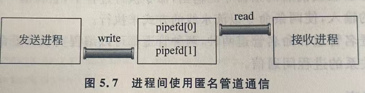

# 重定向和管道命令

### 输入重定向

用符号`<`表示,将进程的文件描述符0关联到指定的文件上去

`command<file`

eg: `mail -s test hr@163.com<file`
表示将file文件所以邮件内容,向hr@163.com邮箱发送一封标题为test的邮件.

### 输出重定向

用符号`>`或`>>`来表示输出重定向;前者以覆盖的方式输出,后者以追加的方式输出

`command>file`或`command>>file `
eg:`cat file1 file2>file3`
表示将文件file1和file2的内容合并输出到文件file3中.

### 错误重定向

用符号`2>`或`2>>`来表示;前者以覆盖的方式输出,后者以追加的方式输出

`command 2>file`或`command2>>file`

使用错误重定向后,如果在命令执行的过程中有错误发生,错误信息会记录在文件file中.

# 实现重定向

重定向是由Shell实现的.

### dup和dup2(复制文件描述符)

```c
int dup(int oldfd);
//被复制的文件描述符
```

函数的返回值返回复制后的新文件描述符

```c
int dup2(int oldfd,int newfd);
```

dup2可以把信息复制给哪一个文件描述符.如果dup2在复制文件描述符时,如果`newfd`已分配给某个打开的文件,那么系统会先关闭`newfd`,切断与原先文件的联系,然后再进行复制.

### 重新向的三种方法

##### close then open

关闭指定的标准I/O设备文件,打开重定向文件

1. 程序调用`close`函数关闭指定的文件描述符与标准设备文件的联系.此时该文件描述符处于空闲可分配状态状态;
2. 使用open函数打开指定的重定向文件.由于open遵循最低可用文件描述符原则,打开的文件将获得第一步操作释放出来的文件描述符.

##### open close  dup close

打开重定向文件,关闭指定的标准I/O设备文件,复制重定向文件的文件描述符,关闭第一步打开的文件描述符

1. 使用open函数打开指定的重定向文件获取该文件的文件描述符fd;
2. 使用close关闭标准I/O文件释放其对应的文件描述符;
3. 使用dup函数复制fd,由于dup函数遵循最低可用文件描述符原则,将会把fd复制给第二步中close释放出来哦的文件描述符;
4. 使用close关闭fd;

##### open dup2 close

打开重定向文件,将指定的标准I/O设备文件描述符作为参数,复制重定向文件的文件描述符,关闭第一步打开的文件描述符.

这种方法与`open close dup close`方法类似,不同在于,dup2将上述方法的第二步和第三步合二为一,直接关闭了标准I/O文件并进行了文件描述符的复制.

# 管道编程

### 匿名管道

```c
int pipe(int pipefd[2]);
//存储匿名管道读端和写端
//0成功,-1失败
```
使用`pipe`创建匿名管道,`pipefd`中存储两个文件描述符,其中`pipefd[0]`对应匿名管道的读端,`pipefd[1]`对应匿名管道的写端.进程间发送信息的时候 ,发送信息的进程连接在管道的写端,接受信息的进程连接在管道的读端.




1. 匿名管道不同于普通文件,匿名管道是内核空间中一段队列式缓冲区,使用匿名管道的进程退出后,匿名管道自动释放,无法保存信息.
2. 对匿名管道进行读/写时,管道另一端必须有相应的写/读进程.默认情况下,管道两端均以阻塞的方式来对匿名管道进行操作.
3. 以阻塞方式读匿名管道时
    * 管道无数据,读进程挂起直到数据被写入;管道数据少于要求读取的量,这立即读出所有的数据;管道数据大于读取的量,读进程立即读出期望大小的数据
    * 写进程关闭与管道的写端联系,读端进程调用`read`返回0,意味读文件结束.
    * 多个文件进程对管道进行读,无法确定读进程执行顺序,需协调读进程对管道的访问
4. 以阻塞方式写匿名管道时
    * 管道已满,继续写,写进程阻塞;
    * 读进程关闭了与管道读端的联系,执行写,写进程收到`SIGPIPE`信号,若该信号不能终止进程,`write`调用返回-1,`errno`置为`EPIPE`
    * 多个文件进程对管道进行写,无法确定写进程执行顺序,需协调写进程对管道的访问
5. 管道两端可以使用`fcntl`函数改变读,写方式.
6. 匿名管道可以实现无亲缘关系的进程间通信,需辅助以文件描述符传递机制.

### 命名管道(FIFO文件)

匿名管道通常实现有亲缘关系的进程间通信,无亲缘关系的进程间通信可使用命名管道文件.
命名管道也叫FIFO文件,可以Shell中使用`mknod`创建,在程序中可使用`mkfifo`创建.

```c
int mkfifo(char *filename,mode_t mode);
//参数1:命名管道文件的名称
//参数2:命名管道的使用方式
```
使用`mkfifo`创建命名管道文件,filename指定的文件必须不存在.

命名管道使用与普通文件相似可使用`open,read,write,close`操作,但本质换式内核空间的队列式内存,故不可使用`lseek`等等位函数移动文件的读写指针.;

### popen 和 pclose

`popen`函数先执行fork创建一个进程,然后在子进程中调用`eXec`函数执行cmd命令或程序,返回一个标准I/O文件流指针,将该指针连接到子进程的标准输入或标准输出.
```c
FILE * popen(char *cmd,char *type);
//参数1:执行的命令
//参数2:连接方式
```
type为r表示子进程为读的对象,w表示子进程为写的对象.

```c
int pclose(FILE * fp);
//参数:要关闭的流文件指针
```


