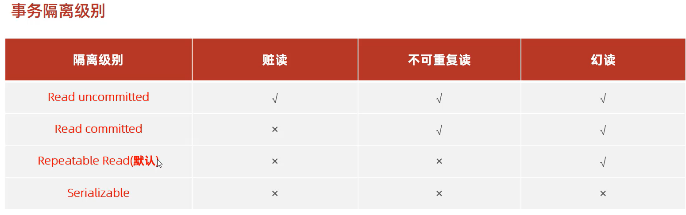

# 事务隔离级别

### 查看事务隔离级别
`select @@transaction_isolation;`
### 设置事务隔离级别
`set [session|global] transaction isolation level {read uncommitted|read committed|repeatable read|serializable};`

* 事务隔离级别越高，数据越安全，但是性能越低。