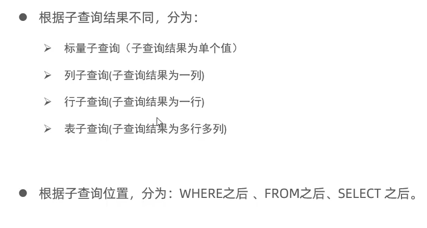
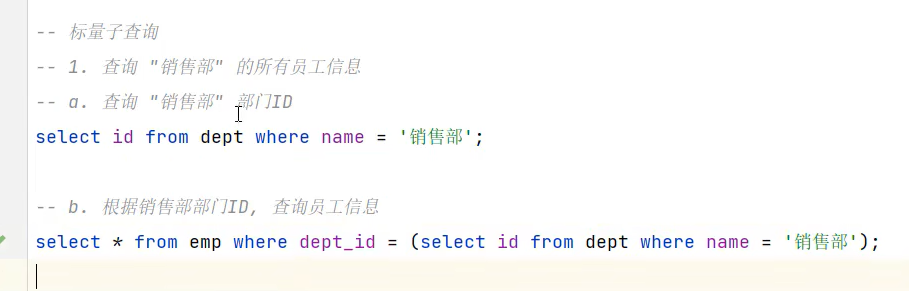
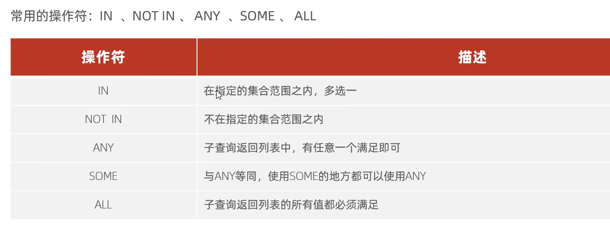
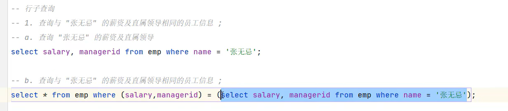
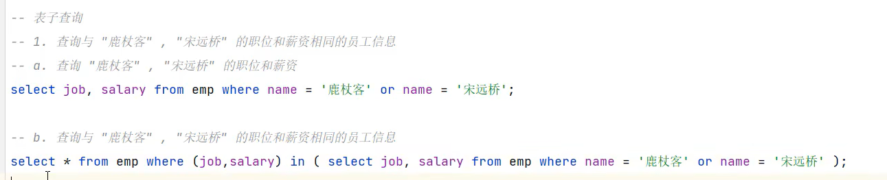

# 子查询
**概念**：SQL语句中嵌套select语句,称为嵌套查询,又称子查询
### 语法
`select * from t1 where column1 = (select column1 from t2);`
* 子查询外部的语句可以是 insert/ update/ delete/ select 的任何一个

## 标量子查询
含义：子查询返回的结果是单个值，最简单的形式，这种子查询称为标量子查询
常用的操作符：= <> > >= < <=
eg:

## 列子查询
含义：子查询返回的结果是一列(可以是多列)，这种子查询称为列子查询

## 行子查询
含义：子查询的结果是一行(可以是多行),这种子查询称为行子查询。
常用的操作符：= <> > >= < <=
eg：

## 表子查询
含义：子查询返回的结果是多行多列，这种子查询称为表子查询
常用的操作符：in
eg：
