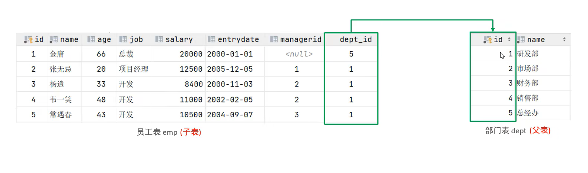
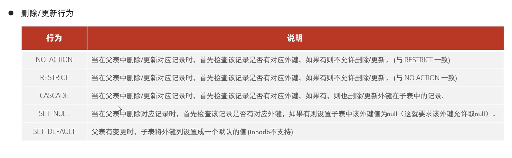

#外键约束
外键用来让两张表的数据之间建立连接,从而保证数据的一致性和完整性。

* 目前上述的两张表,在数据库层面,并未建立外键关联,所以是无法保证数据的一致性和完整性的
##语法
###添加外键
**创建表时添加外键**
```
create table 表名(
    字段名 数据类型,
    ...
    [constraint][外键名称] foreign key(外键字段名)references 主表(主表列名)
)
```
**创建表后添加外键**
`alter table 表名 add constraint 外键名称 foreign key(外键字段名) references 主表(主表列名);`
###删除外键
`alter table 表名 drop foreign key 外键名称;`
