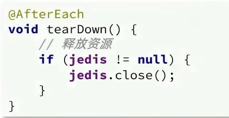

# Jedis

[Jedsi官网](https://redis.io/docs/connect/clients/java/#learn-more)

1. 引入依赖

2. 建立连接

3. 测试string

4. 释放资源

eg:

# jedis连接池

jedis本身是线程不安全的,并且频繁的创建和销毁会有性能损耗.使用Jedis连接池来来提jedis直连方式

线程池的连接方式

