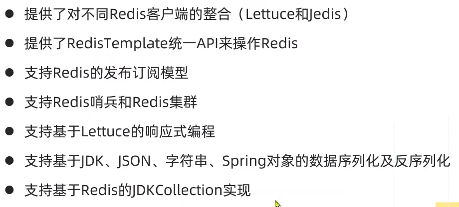
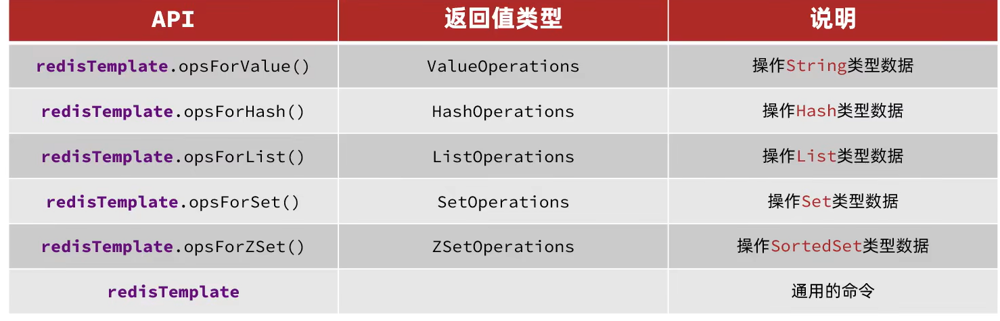
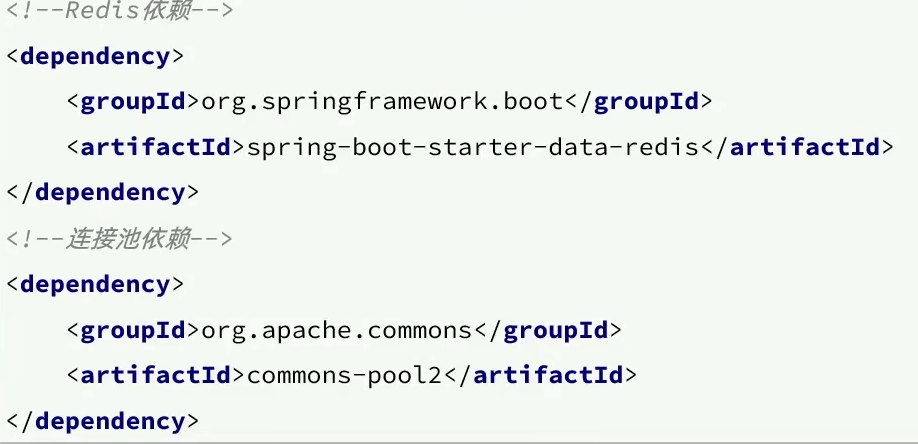
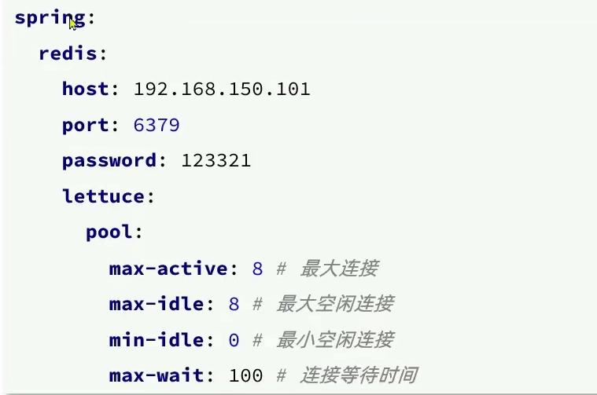
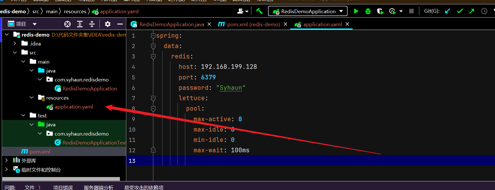
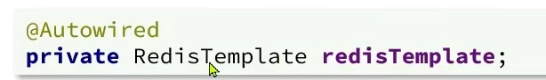
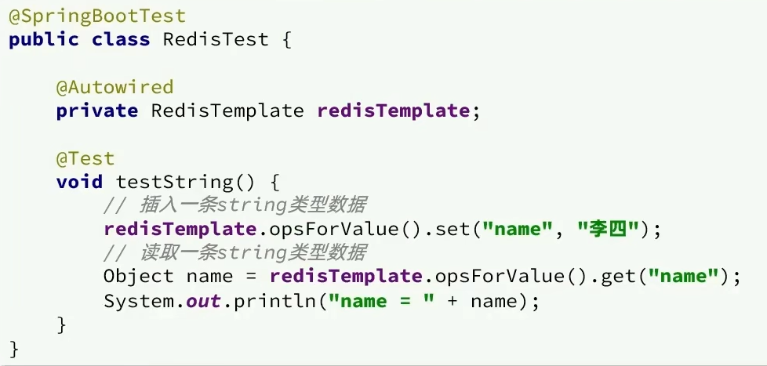

# SpringDataRedis

springData是spring中数据操作的模块,包含对各种数据库的集成,其中对Redis的集成模块就叫做springDataRedis

[官网](https://spring.io/projects/spring-data-redis/)

springDataRedis中提供了RedisTemplate工具类,其中封装了各种对Redis的操作.并且将不同数据类型的操作API封装了不同的类型中:

# 操作

1. 引入依赖

2. 配置文件

3. 注入RedisTemplate

4. 编写测试

