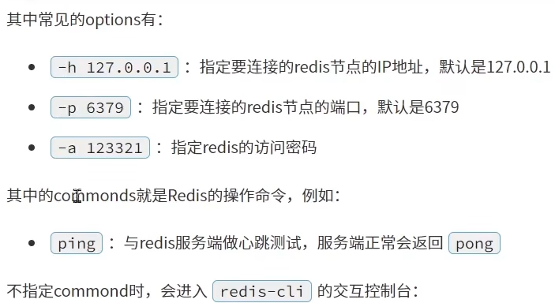

# redis命令行客户端

命令行客户端: redis-cli

使用方式

`redis-cli [options][commonds]`

# 图形化界面

github上开源客户端

[仓库](https://github.com/lework/RedisDesktopManager-Windows)

# Redis的Java客户端

[客户端官网](https://redis.io/docs/connect/clients)

