# redis 的数据结构

Redis 是一个key-value的数据库,key一般是String类型,不过value的类型多种多样

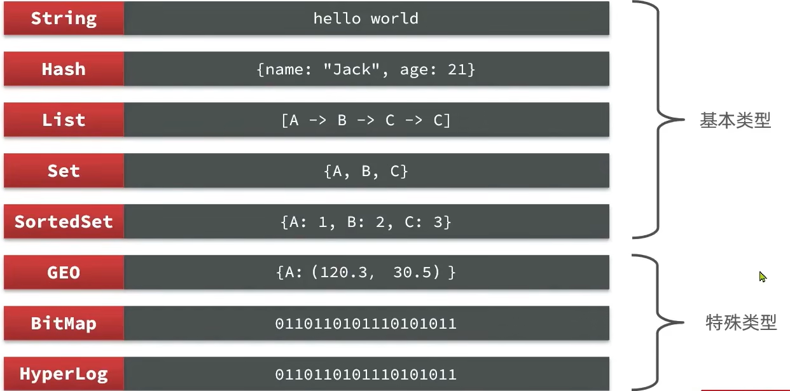

# Redis通用命令

[官方文档查询](https://redis.io/commands/)

命令窗口查询

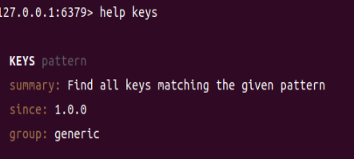

* KEYS:查看符合模板的所有key(不建议在生产环境使用)

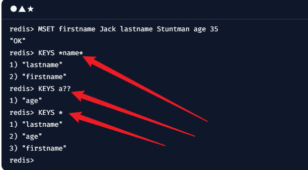

* DEL:删除一个指定的key(返回值代表成功删除的数量)

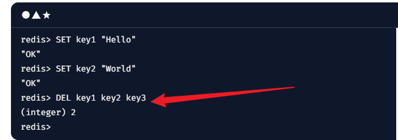

* EXISTS:判断一个key是否存在(1是0否)

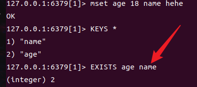

* EXPIRE:给一个key设置有效期,有效期到期时key会被自动删除

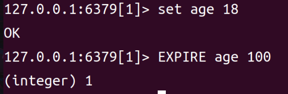

* TTL:查看一个KEY的剩余有效期

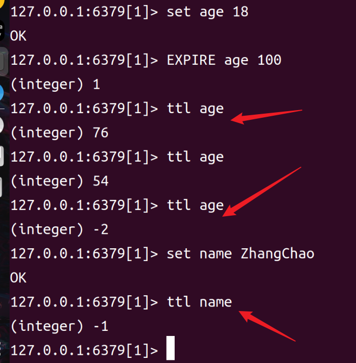

    1.返回值为 -2,表示设置有效期的key有效期结束
    2.返回值为 -1,表示永久有效

==key的结构==

Redis的key允许又多个单词形成层级机构,多个单词之间用:隔开

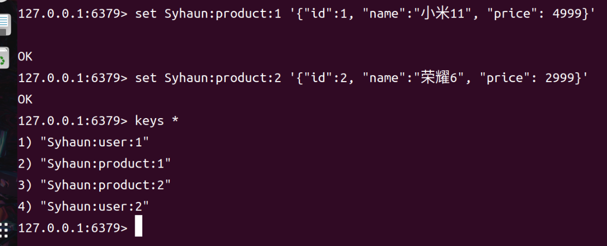

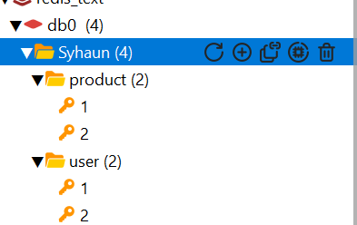

# 非通用指令

## String类型

String类型,字符串类型,redis中最简单的存储类型,value是字符串,根据字符串的格式不同,分为3类

* string:普通字符串
* int:整数而理性,可以自增自减
* float:浮点类型,可以自增自减

无论哪一种格式,底层都是字节数组形式存储,编码方式不用.

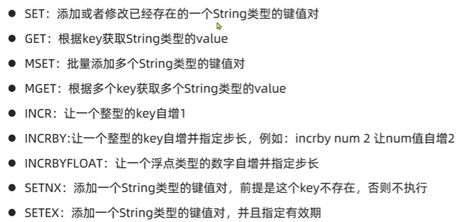

## Hash类型

Hash类型,也叫散列,其value是一个无序字典,类似于java中的HaahMap结构

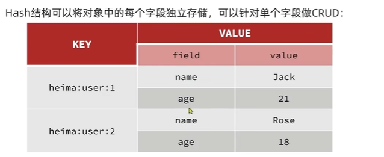

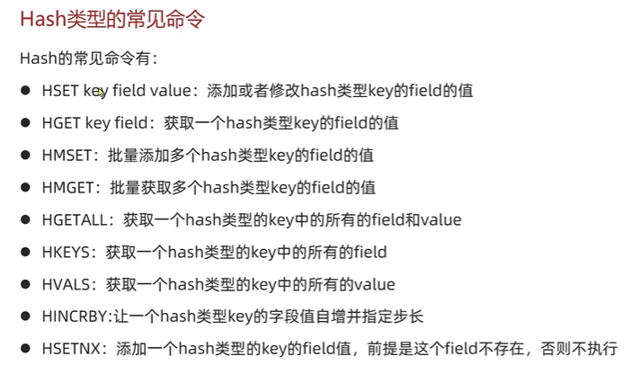

## List类型

Redis中的list类型与java的linkedList类似,可以看作是一个双向链表结构.即可以支持正向检索也可以支持反向检索

特征:有序;元素可以重复;插入和删除快;查询速度一般

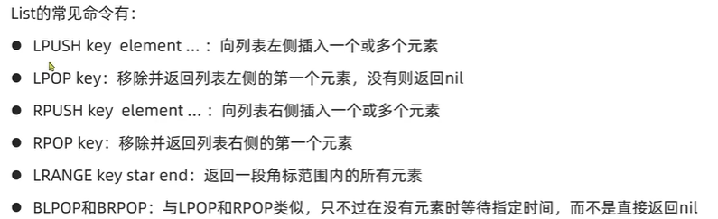

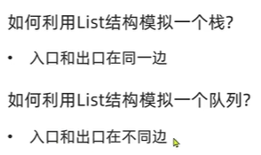

## set 类型

Redis的set结构与java中的hashset类似,可以看作一个value为null的hashmap.

特征: 无序,元素不可重复,查找快,支持交集,并集,差集等功能

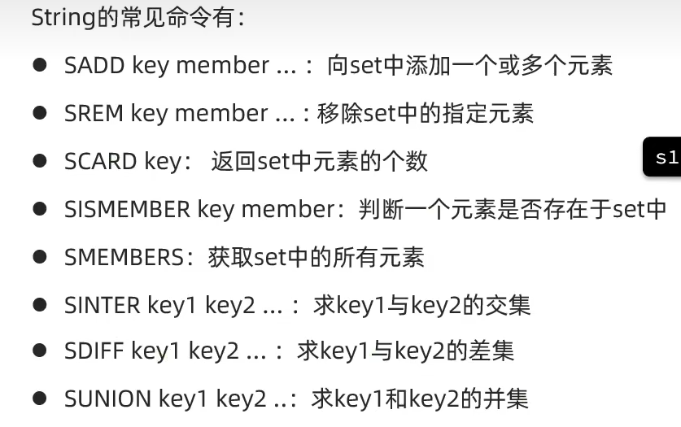

## sortedSet类型

Redis的SortedSet是一个可排序集合,与java中的TreeSet类似,但是底层数据结构差别很大.SortedSet中的每一个元素都带有一个score属性,可以基于score属性对元素排序,底层的实行是一个跳表加hash表.

特性:可排序;元素不重复;查询速度快(由于可排序的特性,常常被用来实现排行榜这样的功能)

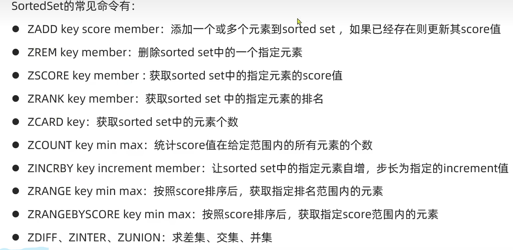

**所有的排名和都是升序,如果要降序则要在命令的z后面添加REV**

