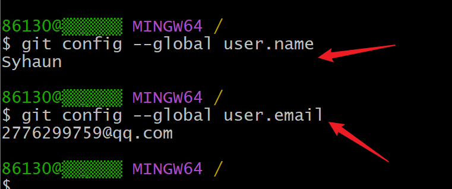

# 基本配置
---
设置用户信息
`git config --global user.name"***"`

`git config --global user.email"****@**"`

查看配置信息
`git config --global user.name`

`git config --global user.email`

# 基础操作指令

创建仓库 
1. 进入需要进行出创建仓库的文件夹
2. 输入命令 
   `git init`

从远程仓库克隆
`git clone 远程Git仓库地址`

