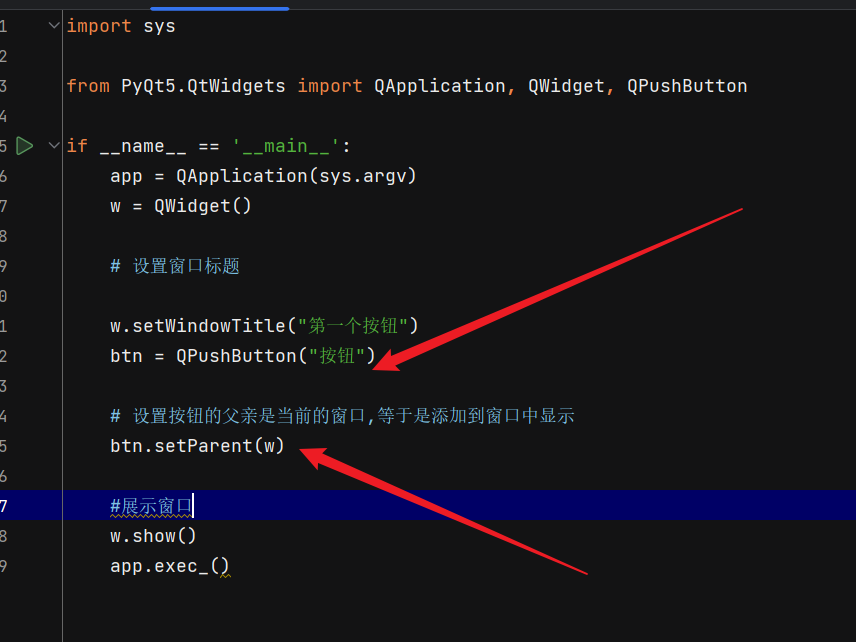
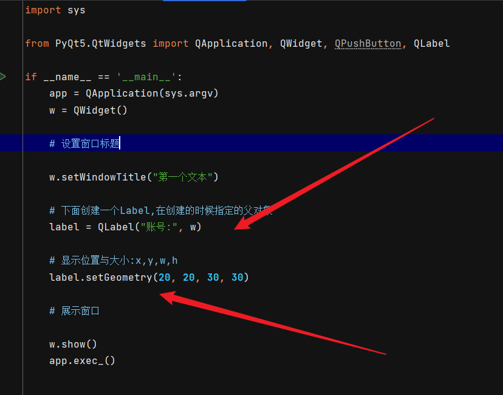
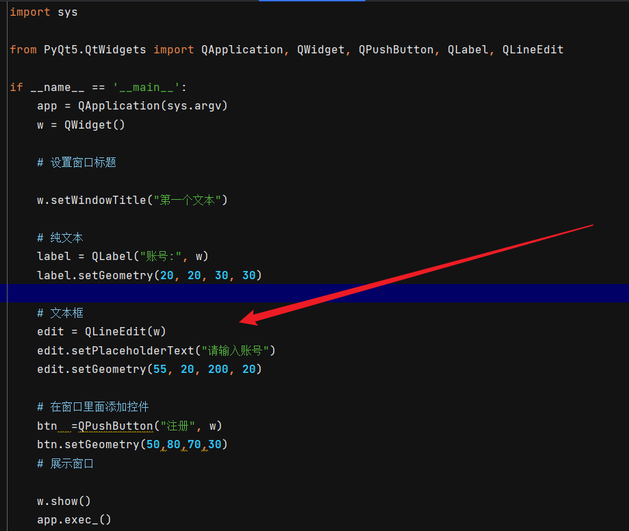
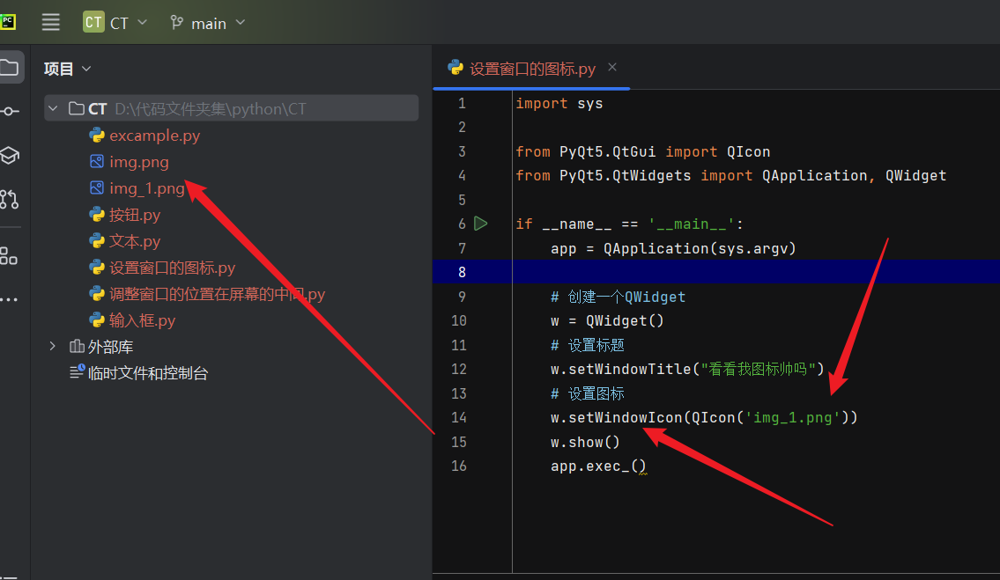

# Qt

跨平台的C++开发库,用于开发图形化用户界面程序

# PyQt

* Qt制作的app,必须有且只有一个QApplication对象
* sys.argv 当作参数的目的是将运行的命令参数传递给QApplication对象

核心功能模块: QtCore(非GUI),QtGui(),QtWidgets(控件)

## 控件

### 按钮



### 文本



### 输入框



---

修改窗口大小:`w.resize(w, h)`

将窗口设置在屏幕的左上角:`w.move(0, 0)`

让窗口置于中央:

```
    center_pointer = QDesktopWidget().availableGeometry().center()
    x = center_pointer.x()
    y = center_pointer.y()
    old_x, old_y, width, height = w.frameGeometry().getRect()
    w.move(x - width / 2, y - height / 2)
```

---

设置窗口的图标



---

## 布局

### 盒子布局(QBoxLayout)


