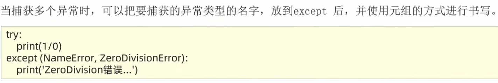
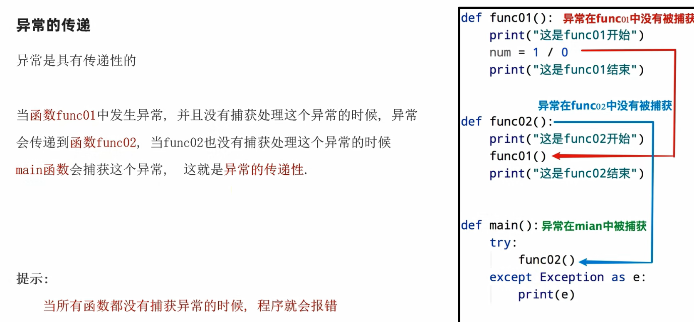

# 捕获异常

语法

```
try:
    可能发生错误的代码
except：
    如果出现异常执行的代码
```

# 捕获指定异常

语法
```
try:
    print(name)
except NameError as e:
    print("name变量没有被定义")
```

# 捕获多个异常



# 捕获所有异常

```
except:
或者
except Exception:
```

## 异常的传递



