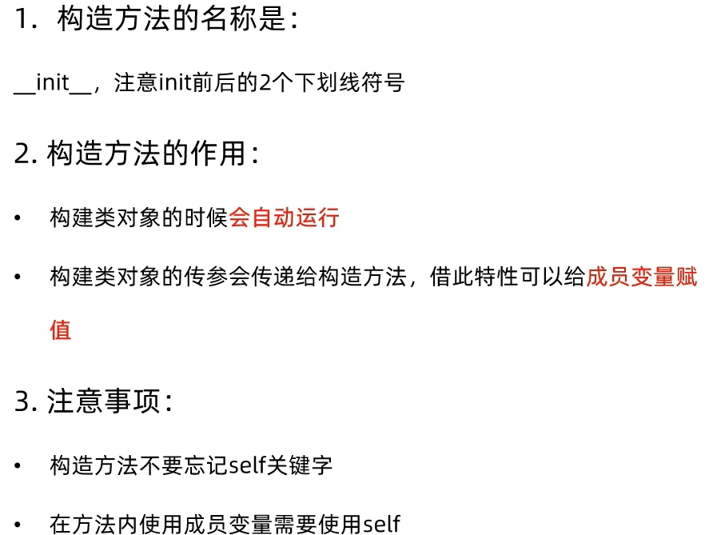

# 构造方法

# 字符串方法

# lt小于符号比较方法

# le小于等于比较符号方法

# eq，比较运算符实现方法

|方法|功能|
|---|---|
|-init-|构造方法，可用于创建类对象的时候设置初始化行为|
|-str-|用于实现类对象转字符串的行为|
|-lt-|用于2个类对象进行小于或大于比较|
|-le-|用于2个类对象进行小于等于或大于等于比较|
|-eq-|用于2个类对象进行相等比较|