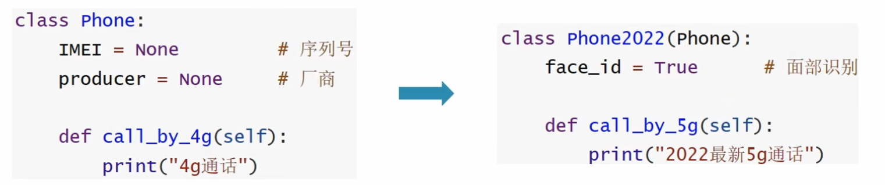
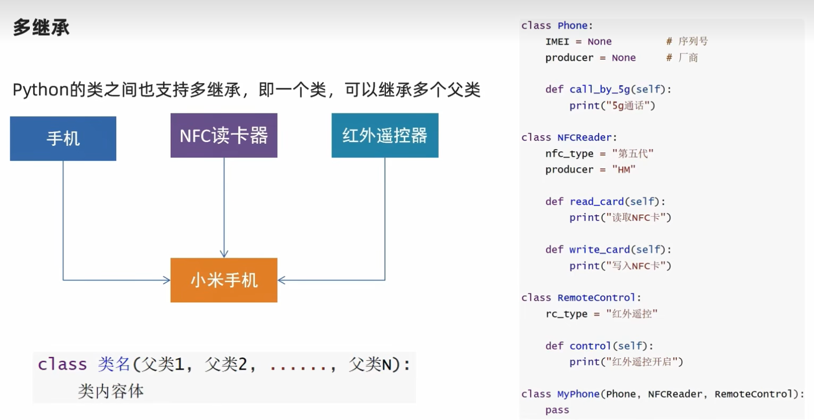
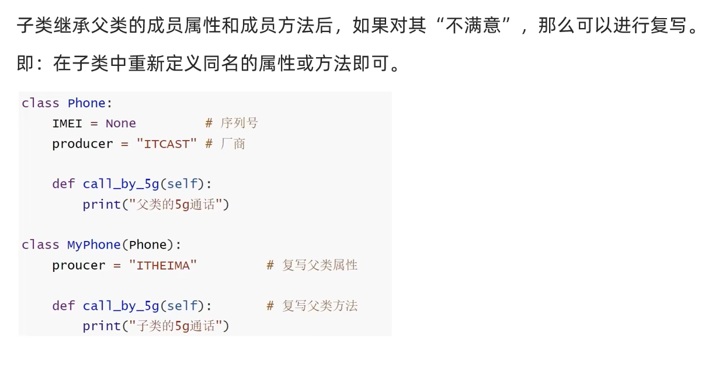
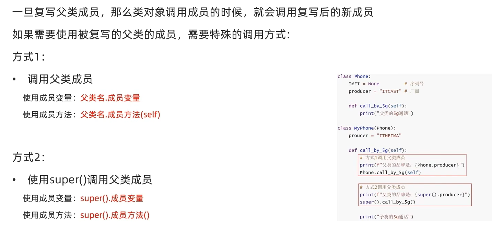
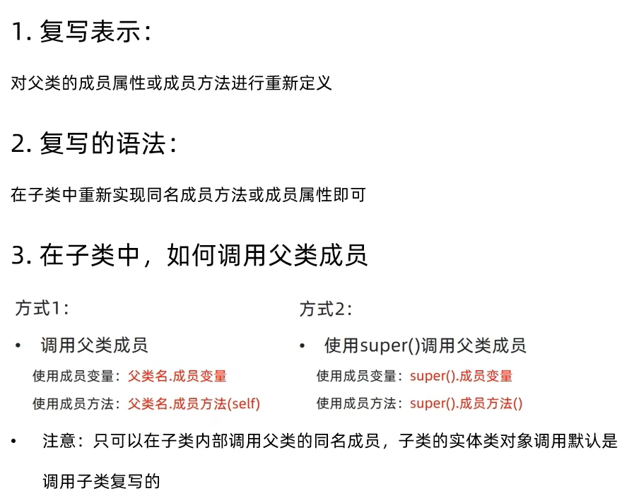

# 继承

## 单继承



语法：
```
class 类名(父类名)：
    类内容体
```

## 多继承



**多个父类中，如果有同名的成员，那么默认以继承顺序(从左到右)为优先级**

即：先继承的保留，后继承的覆盖


### pass关键字的作用

pass是占位语句，用来保证函数或者方法或者说类定义的完整性，表示无内容，空的意思。

# 复写和使用父类成员

## 复写



## 调用父类同名成员






