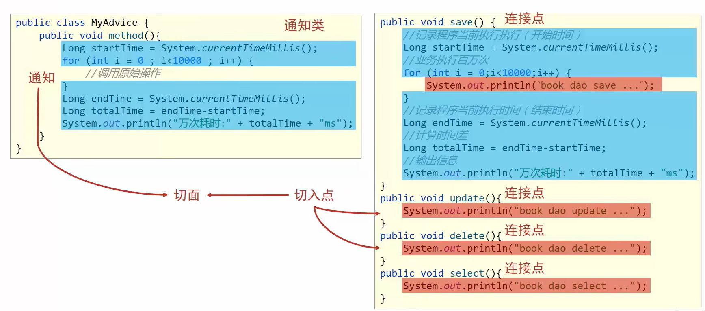

# AOP概述

面向切面编程:在不惊动原始设计的基础上为其进行功能增强

* 连接点:程序执行过程中得到任意位置(所有的方法)
  * 在springAOP中,理解方法的执行
* 切入点:匹配连接点的式子(需要追加功能的方法)
  * 在springAOP中,一个切入点可以只描述一个具体方法,也可以匹配多个方法
* 通知:在切入点处执行的操作,也就是共性功能(追加的方法)
  * 在springAOP中,功能最终以方法的形式呈现
* 通知类:定义通知的类(追加方法的类)
* 切面:描述通知与切入点的对应关系(描述切入点和通知类的关系)
