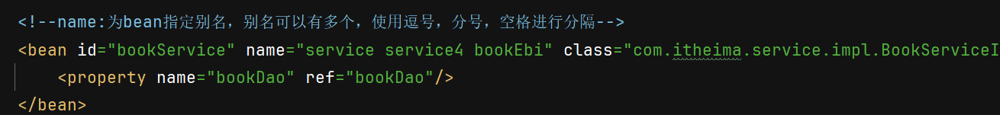
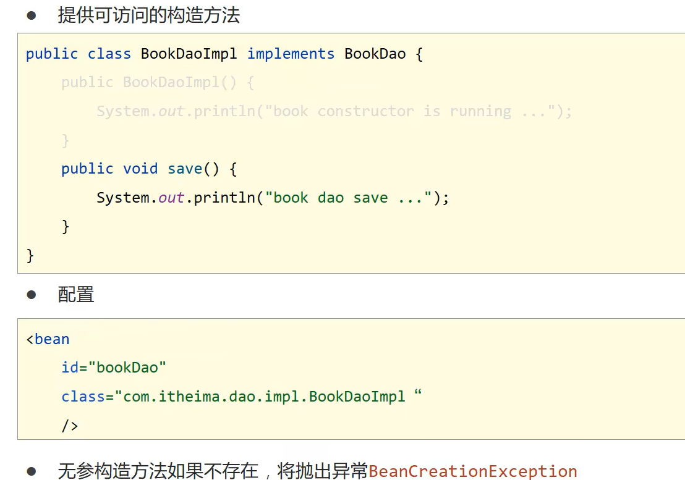
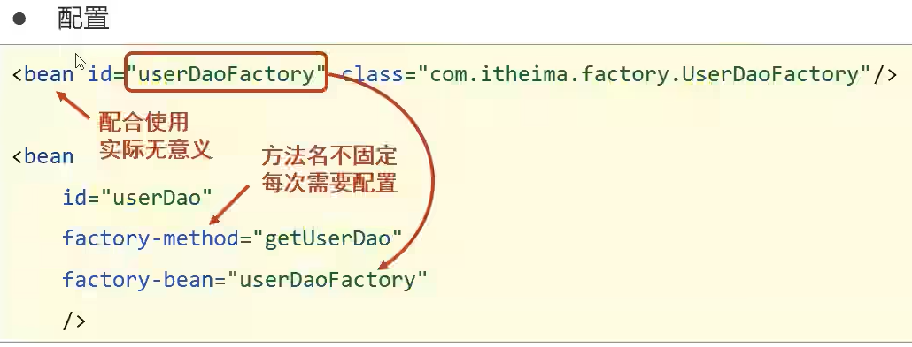
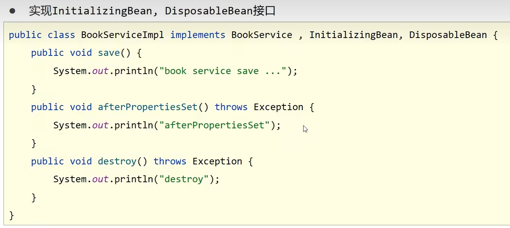

# Ioc(控制反转)
* 使用对象时,由主动new产生对象转移由外部提供对象,对象的创建控制权由程序转移到外部,这种思想称为控制反转
* spring提供一个容器,称为Ioc容器,用来当作Ioc思想中的'外部'
* Ioc容器负责对象的创建,初始化等一系列工作,被创建和管理的对象在Ioc容器中称为Bean
 ---
IOC_demo(XML版本)
1. 导入spring的依赖,在resources下创建配置spring的配置文件

2. 配置bean
bean标签表示配置bean id属性表示给bean起名字 class属性表示给bean定义类型

3. 获取Ioc容器

4. 获取bean

# DI(依赖注入)
* 在容器中建立bean与bean之间的依赖关系的整个过程,称为依赖注入
 ---
DI_demo(XML版本)
5. 提供依赖对象的setter方法 

6. 配置server与dao的关系  
    property标签表示配置当前bean的属性
    name属性表示配置哪一个具体的属性
    ref属性表示参照哪一个bean

## 依赖注入的两种方式
### setter注入:简单类型和引用类型
1. 引用类型

2. 简单类型

### 构造器注入:简单类型和引用类型
引用类型

简单类型

---

## 依赖自动装配
IOC容器根据bean所依赖的资源在容器中自动查找并注入到bean中的过程称为自动装配
              

## 集合注入

## 数据源对象管理

### properties文件的引入
1. 开启context命名空间

2. 使用context空间加载properties文件

3. 使用属性占位符${}读取properties文件中的属性

**需要注意的**

# bean
1. bean基础配置

2. bean别名配置

3. bean作用范围配置

bean默认为单例

---
## bean的实例化
1. 提供可访问的构造方法

2. 静态工厂

3. 实例化工厂

4. 使用FactoryBean

## bean的生命周期

# 容器

## 创建容器
1. 加载类路径下的配置文件

2. 从文件系统下加载配置文件

## 获取bean

-----

