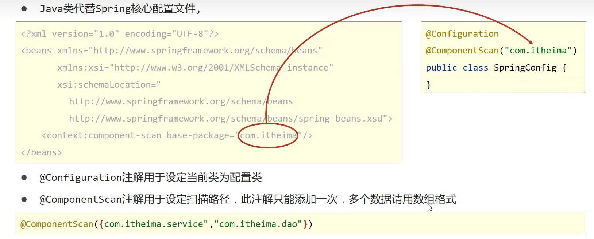

# 注解开发定义bean
1. 使用@Component定义bean

2. 核心配置文件中通过组件扫描加载bean

@Component注解的三个衍生注解

# 纯注解开发
java类代替Spring核心配置文件

读取Spring核心配置文件初始化容器对象切换为读取Java配置类初始化容器对象

# bean的管理

# 依赖注入

 

# 第三方bean管理和依赖注入

----

