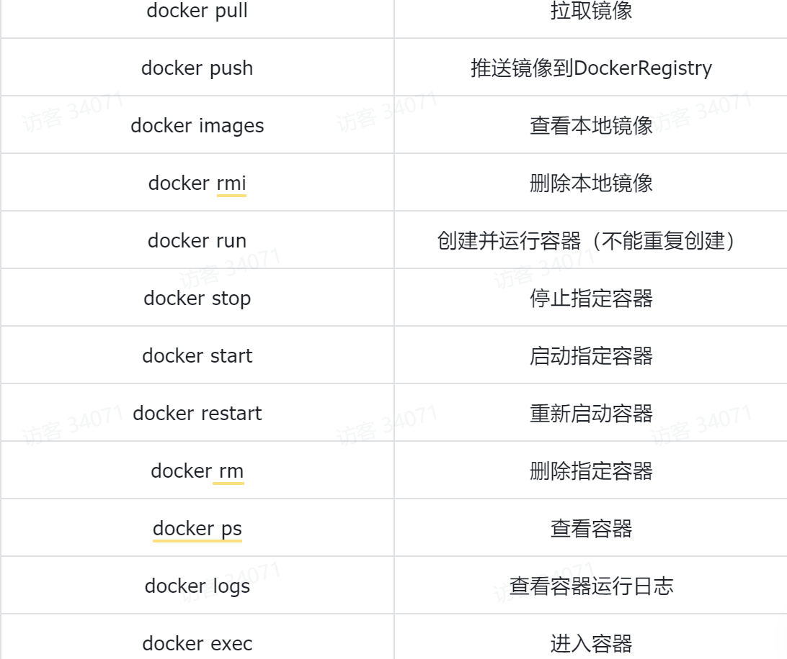
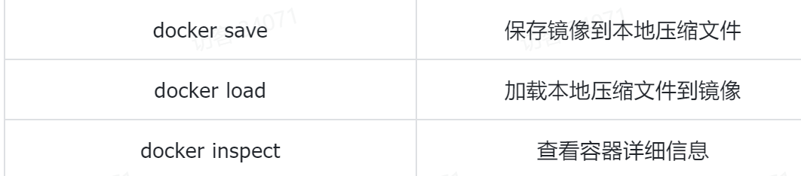
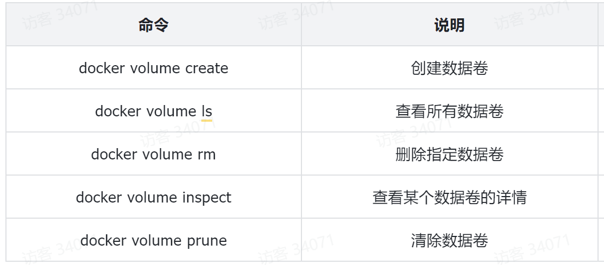
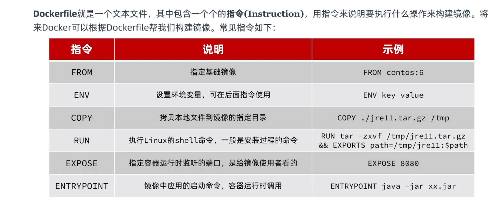
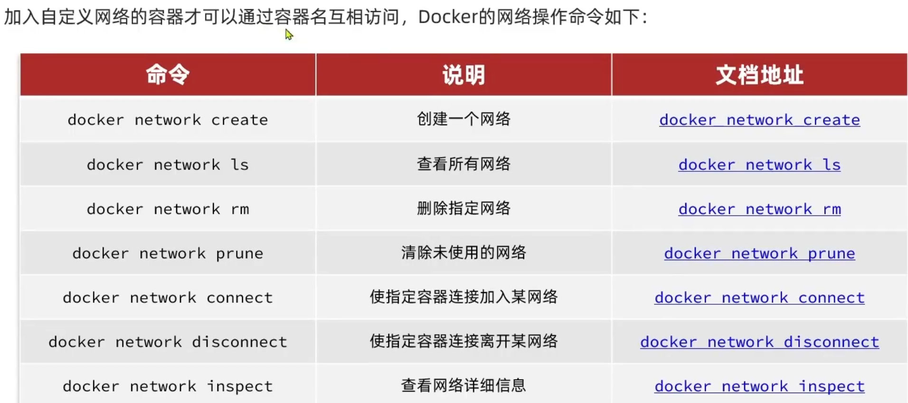

# Docker命令
镜像包含了程序本身和它运行所需要的环境,配置,系统级函数库.在运行的时候就有它自己独立的环境.

# 数据卷命令
数据卷:一个虚拟目录.是容器内目录与宿主机目录之间映射的桥梁
挂载数据卷:
* 在创建容器时,利用- v数据卷名:容器内目录完成挂载
* 容器创建时,如果发现挂载的数据卷不存在时,会自动创建
* 在执行docker run命令时,使用 -v 本地目录:容器内目录可以完成本地目录挂载

# 自定义镜像(构建一个java应用)

镜像结构:
1. 入口:镜像运行入口,一般是程序启动的脚本和参数
2. 层:添加安装包,依赖,配置.,每次操作都形成新的一层
3. 基础镜像:应用依赖的系统函数库,环境,配置,文件

## Dockerfile

构建镜像的命令:docker build -t 镜像名 Dokcerfile目录

## 网络

默认情况下,所有的容器都是以bridge方式连接到Docker的一个虚拟网桥上

## 自定义网络

# DockerCompose