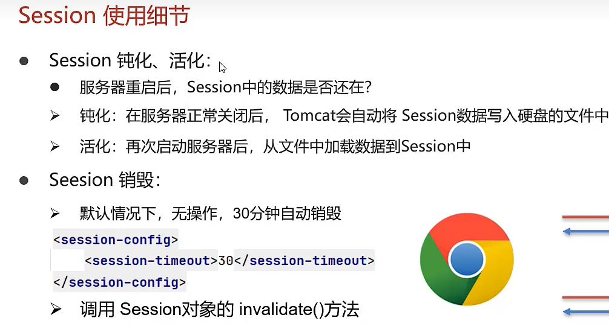

# Session基本使用

Session:服务端会话技术,将数据保存在服务端

JavaEE提供HttpSession接口,来实现依次会话的多次请求间数据共享功能

1. 获取Session对象
    `HttpSession session = request.getSession();`
2. Session对象功能
   * `void setAttribute(String name,Object o);`存储数据到session域中
   * `Object getAttribute(String name)`:根据key,获取值
   * `void removeAttribute(String name):`根据key,删除该键值对

## Session原理

Session是基于Cookie实现的 

