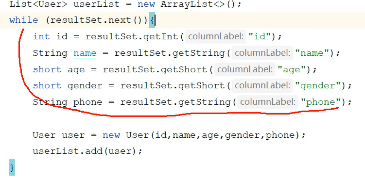

1. 注册驱动


2. 获取连接对象


3. 获取执行SQL的对象Statement,执行SQL,返回结果


4. 封装结果数据



5. 释放资源


```
package com.Syhaun;

import java.sql.Connection;
import java.sql.DriverManager;
import java.sql.SQLException;
import java.sql.Statement;

public class jdbc {
    public static void main(String[] args) throws ClassNotFoundException, SQLException {
        // 注册驱动
        Class.forName("com.mysql.cj.jdbc.Driver");
        // 获取连接
        String password = "Syhaun20040227.";
        String username = "root";
        String url = "jdbc:mysql://localhost:3306/tlias";
        Connection conn = DriverManager.getConnection(url, username, password);
        // 定义 SQL 语句
        String sql = "UPDATE user\n" +
                "SET phone = 10086\n" +
                "WHERE id = 1;";
        // 获取执行 SQL 的对象 Statement
        Statement stmt = conn.createStatement();
        // 执行 SQL
        int count = stmt.executeUpdate(sql); // 受影响的行数
        // 处理结果
        System.out.println(count);
        // 释放资源
        stmt.close();
        conn.close();
    }
}
```

需要下载对应的mysql的驱动包,单独放在lib目录下,右击添加为库.


高版本无需注册驱动