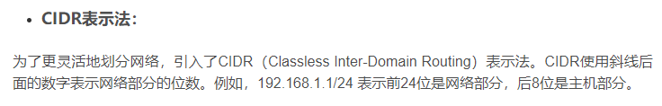
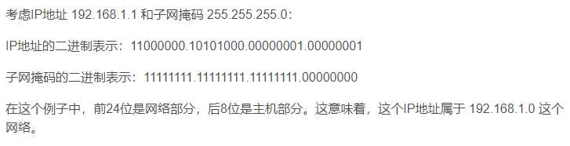
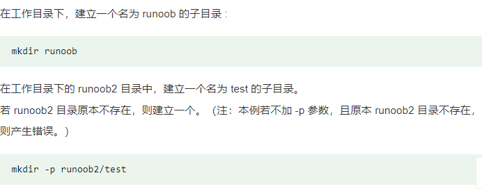

# 问题一(远程客户端)

远程客户端可以连接到远程的服务器,使用MobaXterm就可以连接到远程的服务器

# 问题二(SSH)

SSH是一种远程的登录协议,比较安全,是Linux系统的标配,可以通过SSH连接到远程的服务器.

# 问题三(IPv4 IP 子网掩码)

ip用于标识计算机网络中的设备,IPv4 是一种互联网协议,使用4组十进制数来表示IP地址.
前面一部分用来网络标识,后部分用户主机标识.
子网掩码将IP划分为网络标识和主机标识.(1标识网络地址的部分,0标识主机地址的部分)

# 问题四(mkdir)

mkdir用于创建目录
`mkdir -p 文件名`(-p,确保目录存在,不存在就创建)

eg:

# 问题五(mount)

mount 用于挂载linux系统外的文件

`mount /dev/cdrom /mnt/cdrom`
将/dev/cdrom挂在/mnt/cdrom之下

# 问题六(cp)

cp命令用于复制文件或目录

`cp -r /mnt/cdrom/stage /`(-r 参数递归复制目录下所有的目录和文件)
复制/mnt/cdrom/stage到/

# 问题七(linux文件系统)

1. /:根目录
2. /home:用户的主目录.每个用户都有一个自己的目录,在该目录下
3. /root:超级权限者用户的主目录
4. /etc:系统中的配置文件
5. /usr:应用目录(类似windows的program files)
    * /usr/bin:系统使用的应用程序
    * /usr/sbin:root用户使用的高级管理程序和系统守护程序
    * /usr/src:系统内核源代码
6. /var:缓存或者运行产生的文件
7. /dev:外设
8. /tmp:临时文件
9. /run:临时文件系统,存放系统启动以来的信息,系统重启就会别清清除

# 问题八(ls)

ls命令用于显示当前目录下的内容
`ls /stage/`
-a参数显示所有(包括隐藏)
-l参数长格式显示目录下内容(权限,所有者,大小,修改日期)

# 问题九(dnf)

dnf是包管理器,用于管理rpm的软件包
dnf是yum的升级版,替代yum

`dnf -y ***.rpm`
-y参数表示yes 直接同意下载

# 问题十(cd)

cd是进入该目录(改变当前工作目录,切换到指定路径)
`cd..`切换到上级目录
`cd../../`切换到上上级目录
`cd -`切换到上次访问的目录

# 问题十一(vim)

仅仅说最常用的用法,用vim先打开文件
`vim/etc/my.cnf`
刚进去是命令模式
按下i进行输出模式
:底线命令模式
按下:q 退出
按下:w 保存
按下:wq 保存并退出
按下 !q 强制退出不保存

输入模式:
esc返回命令模式
正确修改文件

# 问题十二(cat)

cat 连接文件输出出来(用于查看文件)

`cat 文件名 | tail -n 100`显示最后100行

cat:一次性显示所有,并可将多个连接显示
more:更强大,提供分页
less:比more更强大,提供翻页,跳转,查找

# 问题十三(|和grep)

|:A|B 命令A的结果传递给命令B
grep:过滤选出指定条件的结果
`cat /var/log/mysqld.log | grep temporary`
使用 cat 命令来显示 MySQL 日志文件 /var/log/mysqld.log 的全部内容。
将 cat 命令的输出通过管道 (|) 传递给 grep 命令，grep 命令会筛选出所有包含 "temporary" 关键词的行。

# 问题十四(scp)
scp用于主机之间复制文件和目录

`scp -r /stage/ root@server2:/`
递归的想本机/stage下所有的目录和文件传输到server2下的/目录

# 问题十五(ping)

ping命令用于测试局域网之间主机的连通性