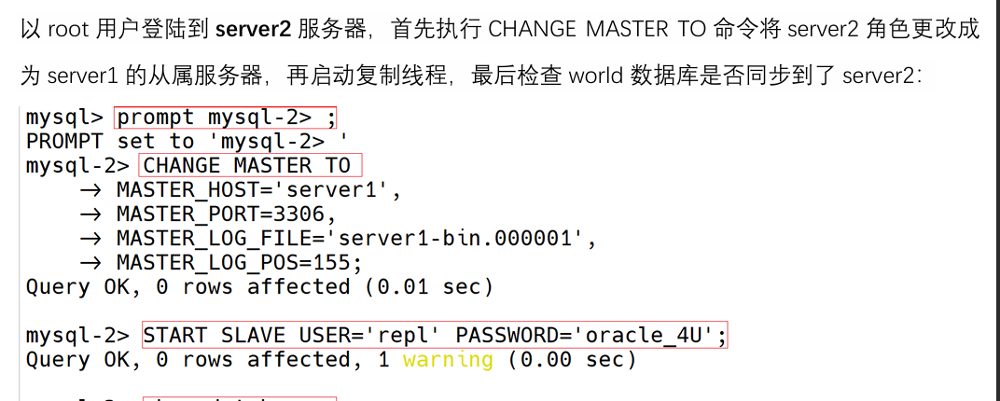

# 问题一和问题二(Mysql复制技术原理(主从架构))

复制mysql可以使服务器从一个实例复制到另外一个实例.
复制工作的原理:
主从架构,一个主服务器多个从服务器,主服务器进行curd,操作记录到二进制日志中,从服务器读取日志同步主服务器的数据

# 问题三(二进制文件)
进制日志记录了所有的 DDL(数据定义语言)语句和 DML(数据操纵语言)语句，但不包括数据查询(SELECT、SHOW)语句。
作用：
1. 灾难时的数据恢复;
2.  MySQL的主从复制。在MySQL8版本中，默认二进制日志是开启着的

记录格式:
1. row:基于行的日志记录,记录每一行的数据变更(默认)
2. statement:基于sql语句的日志记录,记录的是sql语句
3. mixed:混合前两种,默认采用statement,特殊情况时自动切换为row

# 问题四(mater与slave角色)

1. 配置主服务器:在主服务器上配置二进制日志,并创建用于复制的用户
mysql配置文件的配置:
打开`vim /etc/my.cnf`
修改为:  
注意：一个复制结构中的每台 mysqld 实例必须要有唯一的 server-id,log-bin 和 relay-log 分别用来定义二进制日志文件和中继二进制日志文件，也要注意区分编号.  
创建用户repl密码为Syhaun,使用非加密验证插插件mysql_native_password:`create user 'repl' identified with mysql_native_password by 'Syhaun'`  
给用户replication slave权限:`grant relication slave on *.* to 'repl';`
2. 获取主服务器二进制日志坐标:确保从服务器开始复制的起点.
`show master status`查看服务器状态

3. 配置从服务器:  

# 问题五(show processlist)
`shwo processlist`:查看复制进程的状态  
  
 
# 问题六(复制拓扑三个进程的作用)
转储线程:在主服务器上运行  
从服务器请求开始复制时,主服务器启动一个转储线程,该线程负责将不断的把主服务器二进制日志发送给从服务器I/O线程  
I/O线程:在从服务器上运行  
从服务器I/O线程服务和组服务器建立连接,向主服务器请求二进制日志并将接受的二进制日志写入从服务器的中继日志  
SQL线程:在从服务器上运行  
从中继日志中读取事件,将这些事件应用到从服务器的数据库中

# 问题七(mysqldump工具进行数据库数据迁移)

mysqldump工具可以将数据库整体转储到一个sql文件中并保存  
`mysqldump -u root -p -- master-data=2 -B world > tmp/server2.sql`  
--master-data=2选项可以在输出文件中添加注释起来change master to语句  

# 问题八(\作用)

换行连接,命令太长了 命令后==空格+\再enter==下一行继续写

# 问题九(从服务器开始复制行为)

1. 启动I/O进程
2. 启动sql进程
3. 处理异常和错误
# 问题十(show slave status命令)

`show slave status\G`  
查看I\O线程和SQL线程的运行状态  

# 额外

`prompt mysql-2>`
修改mysql命令行的提示符