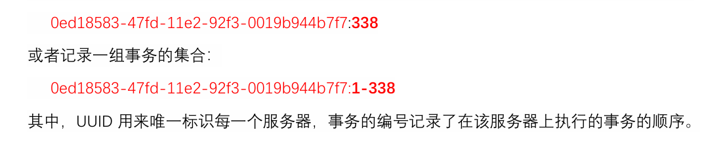
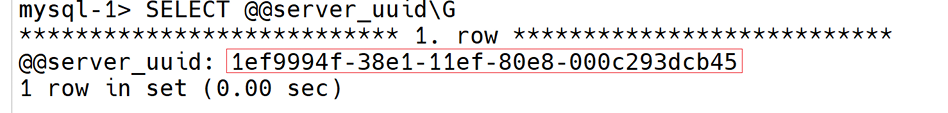
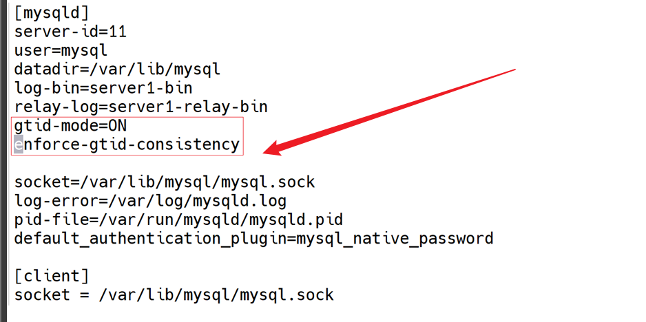

# 问题一(GTID配置复制拓扑)

使用二进制日志可以来标记复制的位置.但是在循环,双向,多源复制等复杂的拓扑结构中,二进制日志坐标没法用来在整个复制拓扑中唯一标识一个事务,故使用GTID(全局事务标识符)来记录整个拓扑中所产生的更改事务  
每个GUID记录了一次修改格式为<source-uuid>:<transaction-id>
eg:  
查看服务器UUID:`select @@server_uuid\G`  

mysql配置文件中  

# 问题二(查看变量值)

select查询语句

# 问题三(stop slave)

停止从服务器I/O进程和SQL进程:`stop slave;` 

# 问题四(reset master)

重新设置主服务器:`reset master;`

