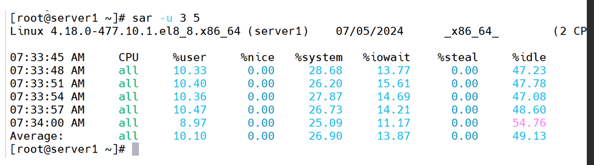
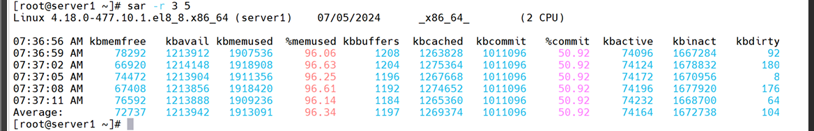
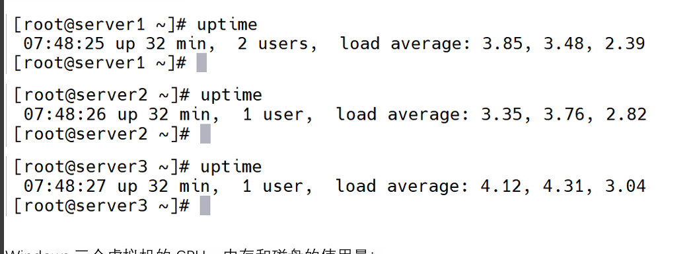

# 问题一(mysqlslap在mysql压力测试)
```shell
mysqlslap --user=root--password=oracle_4U -concurrency=1000 \
--iterations=1000 --number-char-cols=4 --number-int-cols=7 \
--auto-generate-sql --number-of-queries=100000 \
--auto-generate-sql-load-type=update
```
模拟1000个并发连接,进行1000迭代,每次迭代执行100,000条语句

# 问题二(sar工具)
sar工具对系统状态进行取样(每隔3秒 进行5次取样)  
CPU:`sar -u 3 5`  
内存:`sar -r 3 5 `
磁盘:`sar -d 3 5 `

输出结果含义
1. cpu

   1. %user:用户进程使用CPU百分比
   2. %nice:调整优先级的用户进程使用的百分比
   3. %system:内核进程使用的CPU百分比
   4. %iowoit:CPU等待I/O操作完成的时间百分比
   5. %steal:虚拟CPU从物理CPU中被盗用的时间百分比
   6. %idle:CPU空闲时间百分比

2. 内存

   1. kemenfree:空闲内存量
   2. kbmemused:已用内存量
   3. kbbuffers:内存缓冲区
   4. kbcached:缓存内存量
   5. commit:已承诺的内存占总可用内存的百分比
3. 磁盘 
   1. DEV:磁盘设备名
   2. tps:每秒传输的次数(I/O请求次数)

# 问题三(uptime)


* 当前系统时间
* 系统已运行时间
* 当前登录的用户数目
* 系统的平均负载(1分钟,5分钟,15分钟)

   