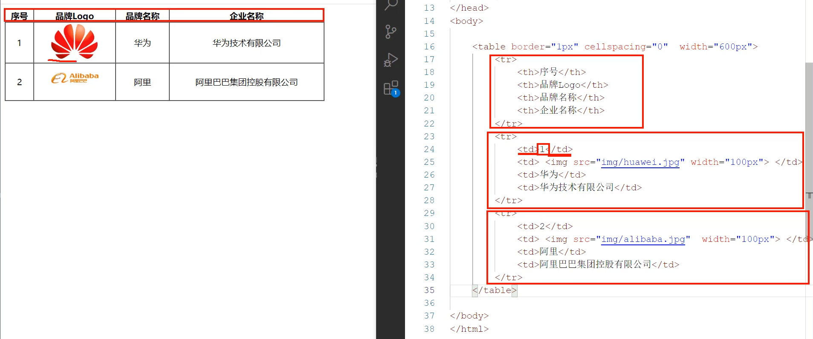

# 图片标签：
< Img src="..." wight="..." height="...">
* src:指定图像的url (绝对路径 / 相对路径)
  * 绝对路径:绝对磁盘路径(D:/xxxx),绝对网路路径(https://xxxx)
  * 相对路径:从当前文件开始查找。(./ : 当前目录, ../ : 上级目录)
* width：图像的宽度 (px,像素 / %, 相对于父元素的百分比)
* height：图像的高度 (px,像素 / %, 相对于父元素的百分比)
# 标题标签：
< h1> ~ < h6>
# 水平线标签：
< HR>
# < span>标签
* < span> 是一个在开发网页时大量会用到的没有语义的布局标签
* 特点：一行可以显示多个(组合行内元素),宽度和高度默认由内容撑开
# 视频标签：< video>
* scr: 规定视频的url
* controls：显示播放控件
* width：播放器的宽度
* height：播放器的高度
# 音频标签：< audio>
* scr: 规定视频的url
* controls：显示播放控件
# 段落标签：< p>
# 文本加粗标签：< b> / < strong>
# 换行标签：< br>

# 表格标签
* 场景：在网页中以表格 (行,列) 形式整齐暂时数据,如:班级表
* 标签：

|标签|描述|属性/备注|
|---|---|---|
|< table>|定义表格整体,可以包裹多个 < tr>|border: 规定表格边框的宽度 width: 规定表格的宽度 cellspacing:规定单元之间的空间|
|< tr>|表格的行,可以包裹多个 < td>||
|< td>|表格单元格(普通),可以包裹内容|如果是表头单元格,可以替换为< th>|

