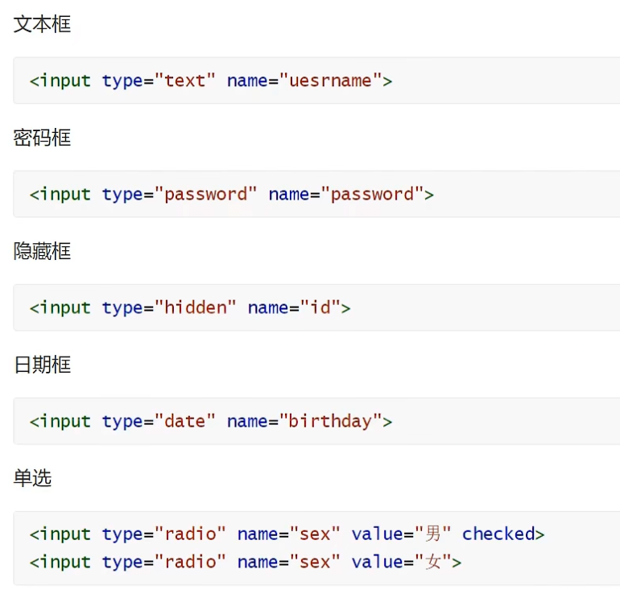
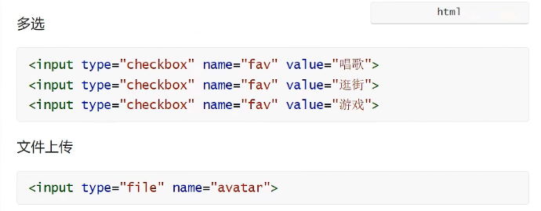

#表单标签
* 场景：在网页中主要负责数据采集功能,如 注册, 登录等数据采集.并且将这些数据提交给服务器
* 标签：< form>
* 表单项：不同类型的 input 元素,下拉列表,文本域等。
  * < input>:定义表单项,通过type属性控制输入形式
    
    
  * < select>:定义下拉列表
  * < textarea>:定义文本域
* 属性：
    * action：规定当提交表单时向何处发送表单数据,url
    * method: 规定用于发送表单数据的方式。
        * get:表单数据拼接在url后面,?username=java,大小有限制
        * post:表单数据在请求体中携带,大小没有限制
**注意：表单项必须有name属性才可以提交**
