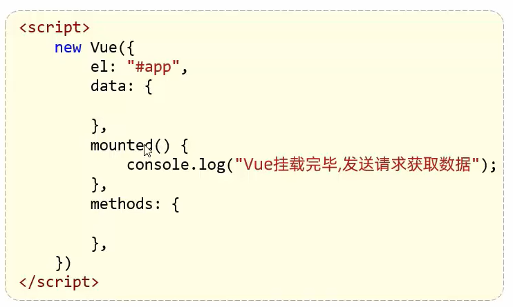
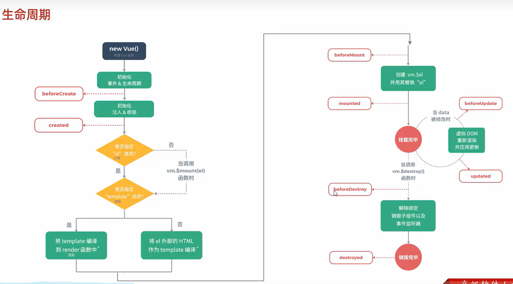

# 生命周期
 
 * 生命周期：值一个对象从创建到销毁的整个过程
 * 生命周期的八个阶段：每触发一个生命周期,会自动执行一个生命周期方法(钩子)

|状态|阶段周期|
|---|---|
|beforeCreate|创建前|
|created|创建后|
|beforeMount|挂载前|
|mounted|挂载完成|
|beforeUpdate|更新前|
|updated|更新后|
|beforeDestroy|销毁前|
|destroyed|销毁后|

