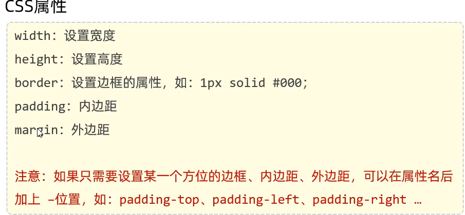

# 颜色表现形式

|表示方式|表示含义|取值|
|---|---|---
|关键字|预定义的颜色名|red,green,blue|
|rgb表示法|红绿蓝三原色,每项取值范围: 0-255|rag(0,0,0),rag(255,255,255),rag(255,0,0)|
|十六进制表示法|#开头,将数字转换成十六进制表示|#000000,#ff0000,#cccccc,简写：#000,#ccc|
* 十六进制写法：前两位表示红，中间两位表示绿，最后两位表示蓝。如何表示某种颜色的两个字符一样，可以进行只写一个来进行简写。
# css 选择器

优先级：id选择器 > 类选择器 > 元素选择器
# css属性
* color：设置文本的颜色
* font-size：字体大小 (注意：记得加px)
* text - decoration: 规定添加到文本的修饰,none表示定义标准的文本
* line-height:设置行高
* text-indent:定义第一行内容的缩进
* text-align:规定元素中的文本的对平对齐方式
**在HTML中无论输入多少个空格,都只会显示一个。可以使用空格占位符：&nbsp;**

# css引入方式
* 行内样式：写在标签style属性中(不推荐)
  
* 内嵌样式：写在style标签中(可以写在页面任何位置,但通常约定写在head标签中)
  
* 外联样式：写在一个单独的.css文件中(需要通过 link 标签在网页中引入)
  