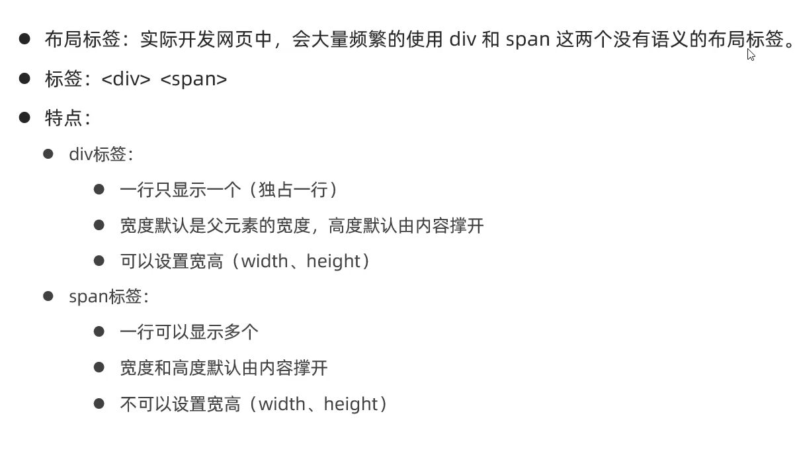
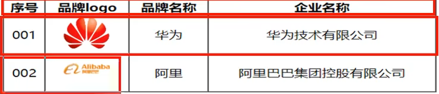
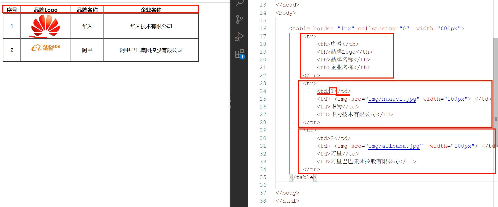
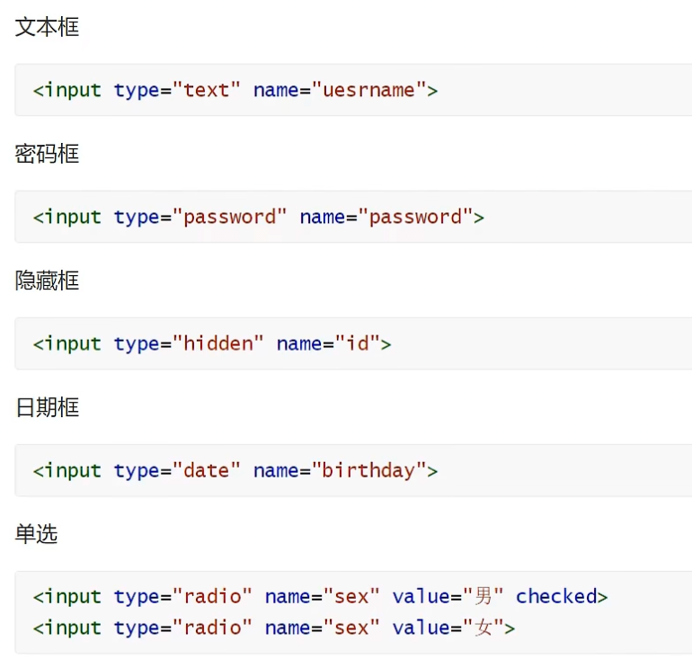
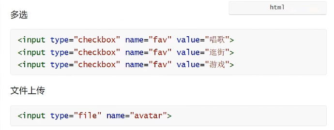
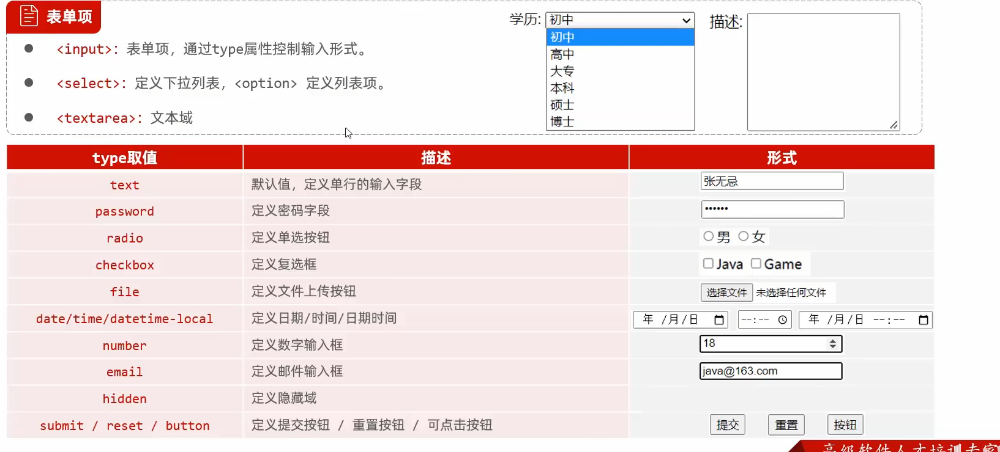
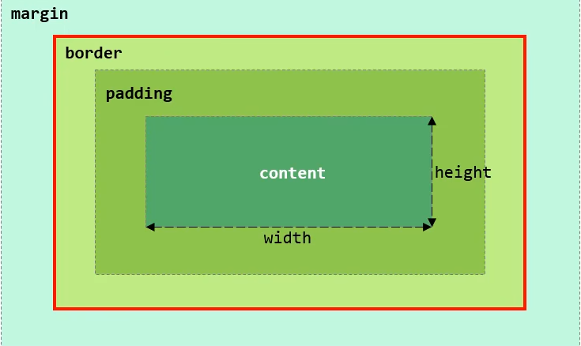

# 结构标签
```
<html>
    <head>
        <title>标题</title>
    </head>
    <body>

    </body>
</html>
```
# 特点
* html标签不区分大小写
* html标签属性值单双引号都可以
* html语法松散

# 图片标签：
< Img src="..." wight="..." height="...">
* src:指定图像的url (绝对路径 / 相对路径)
  * 绝对路径:绝对磁盘路径(D:/xxxx),绝对网路路径(https://xxxx)
  * 相对路径:从当前文件开始查找。(./ : 当前目录, ../ : 上级目录)
* width：图像的宽度 (px,像素 / %, 相对于父元素的百分比)
* height：图像的高度 (px,像素 / %, 相对于父元素的百分比)
# 标题标签：
< h1> ~ < h6>
# 水平线标签：
< HR>  
# < span>标签
* < span> 是一个在开发网页时大量会用到的没有语义的布局标签
* 特点：一行可以显示多个(组合行内元素),宽度和高度默认由内容撑开
# 视频标签：< video>
* scr: 规定视频的url
* controls：显示播放控件
* width：播放器的宽度
* height：播放器的高度
# 音频标签：< audio>
* scr: 规定视频的url
* controls：显示播放控件
# 段落标签：< p>
# 文本加粗标签：< b> / < strong>
# 换行标签：< br>

# 表格标签
* 场景：在网页中以表格 (行,列) 形式整齐暂时数据,如:班级表
* 标签：

|标签|描述|属性/备注|
|---|---|---|
|< table>|定义表格整体,可以包裹多个 < tr>|border: 规定表格边框的宽度 width: 规定表格的宽度 cellspacing:规定单元之间的空间|
|< tr>|表格的行,可以包裹多个 < td>||
|< td>|表格单元格(普通),可以包裹内容|如果是表头单元格,可以替换为< th>|



# 超链接
## 标签
<a href="..." target="..."></a>
##属性
href: 指定资源访问的url
target：指定在何处打开资源链接
* _self:默认值,在当前页面打开
* _blank: 在空白页面打开

# 表单标签
* 场景：在网页中主要负责数据采集功能,如 注册, 登录等数据采集.并且将这些数据提交给服务器
* 标签：< form>
* 表单项：不同类型的 input 元素,下拉列表,文本域等。
  * < input>:定义表单项,通过type属性控制输入形式
    
    
  * < select>:定义下拉列表
  * < textarea>:定义文本域
* 属性：
    * action：规定当提交表单时向何处发送表单数据,url
    * method: 规定用于发送表单数据的方式。
        * get:表单数据拼接在url后面,?username=java,大小有限制
        * post:表单数据在请求体中携带,大小没有限制
**注意：表单项必须有name属性才可以提交**


# 盒子模型
* 盒子：页面中所有的元素(标签),都可以看做是一个盒子,由盒子将页面中的元素包含在一个矩形区域内,通过盒子的视角更方便的进行页面布局
* 盒子模型组成： 内容区域(content),内边距区域(padding),边框区域(border),外边框区域(margin)
