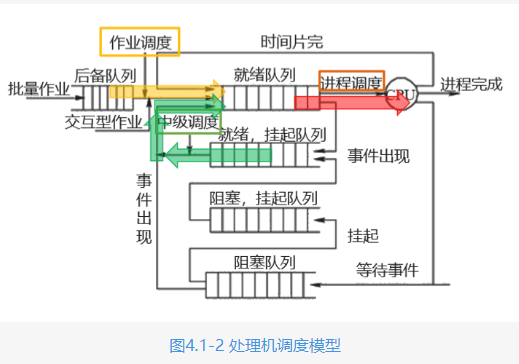
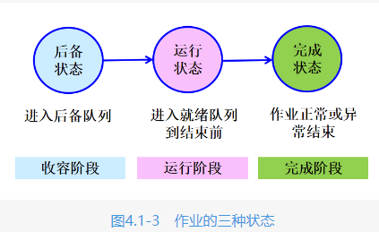
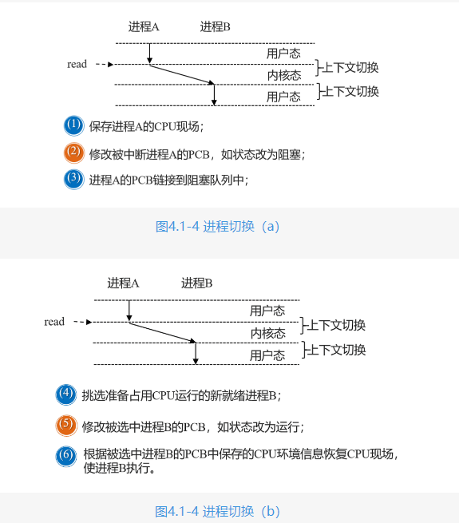
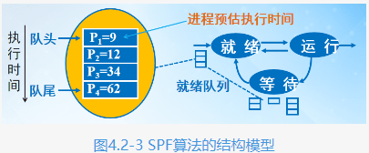
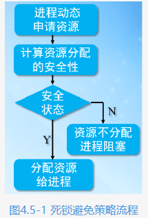

# 处理机调度层次和调度算法准则

### 处理机调度模型

##### 高级调度(作业调度)

完成了作业从外存如磁盘进入内存，并为作业建立进程的过程。

##### 低级调度(进程调度)

系统根据进程调度算法，选择就绪队列中的某个进程将处理机分配给它，使选中的进程执行。就绪队列的实现可以是FIFO队列、树或简单的无序链表等。

##### 中级调度(不是所有的OS都需配置中级调度)

当内存紧缺时，系统会将暂时不能执行的进程通过挂起操作换出至外存等待，以便腾出足够内存空间供急需的进程使用，挂起的进程暂时不参与调度，当这些进程重新具备运行条件且内存空闲时，由中级调度决定哪些进程可以对换到内存，进入就绪队列等待低级调度，在一些比较完善的OS会中引入这种调度。

### 进程调度

对于多道系统，当前运行进程主动或被动放弃CPU使用权时，CPU空闲，会产生处理器调度时机。

### 调度方式

1. 抢占式调度方式(系统开销大)

抢占式调度方式如同“抢占式”词义所示，这种处理机调度方式允许某就绪进程可以抢走当前进程CPU的使用权，因此它是一种不友好的调度方式。具体为当一个进程正在执行时，系统可以基于某种策略剥夺CPU使用权给其他进程。

    1. 优先权原则。高优先权进程可以抢占低优先权进程CPU使用权；
    2. 短进程优先原则。预估执行时间短的进程可抢占执行时间长进程的CPU使用权；
    时间片原则。适用于分时系统中，当分配的时间片结束时，当前进程的CPU使用权会被抢走，选中的新进程使用CPU。
2. 非抢占式调度方式

    非抢占式调度方式与抢占式调度含义相反，这种处理机调度方式不允许某就绪进程抢走当前进程CPU的使用权，调度程序一旦把 CPU分配给某一进程后，直到进程完成或发生事件而不能运行时，才将CPU分给其他进程，显然这是一种友好的调度方式，这种调度方式通常用于批处理系统中，它的优点是简单、系统开销小。

# 调度算法

### 先来先服务算法(FCFS算法)

策略为根据作业进入后备队列的先后顺序确定哪个或者那几个作业调入内存.

在进程调度中采用该算法时，其策略是按照进程进入就绪队列的先后次序分派CPU，当前进程会一直占用CPU，直到执行完或阻塞，才出让CPU（非抢占方式）；在进程唤醒后（如I/O完成），并不立即恢复执行，通常要等到当前进程让出CPU时。

特点:
* 比较有利于长作业，而不利于短作业。短作业只需要占用较短的CPU时间，却因到达就绪队列较晚而一直获得不了调度的机会，这对短作业不利，该算法可能会导致较长的平均周转时间，获取较低的系统吞吐量
* 有利于CPU繁忙的进程，而不利于I/O繁忙的进程。CPU繁忙进程的代表就是科学计算任务，这种任务将会占用很长时间的CPU，而I/O繁忙进程的代表是交互式任务，这种任务被调度占用CPU后，很快就会释放CPU。

### 短进程优先调度算法(SPF算法)

选择调度就绪队列中需要CPU执行时间最短的进程.

优点:相比FCFS算法，改善了平均周转时间和平均带权周转时间，缩短作业的等待时间，提高系统的吞吐量。
缺点:对长进程非常不利，可能长时间得不到执行；未能依据进程的紧迫程度来划分执行的优先级；难以准确估计进程的执行时间，从而影响调度性能。

### 优先权调度算法(HPF算法)

选择调度就绪队列中优先权最高的进程获得CPU的使用权.(抢占式和非抢占式)

静态优先权:表示进程的优先权一旦分配将不再改变，一般在进程创建时指定优先级，优先级一般使用整数表示，并且具有一定范围，比如[0，255]，有些OS系统大数表示高优先权，而有些OS则小数表示高优先权。

动态优先级:在进程创建时创立一个优先级，但在其生命周期内优先数可以动态变化。

优先权的确定
* 进程类型。通常系统进程（如接收进程、对换进程）的优先级高于一般用户进程优先级，从而保证重要进程优先运行。
* 进程对资源的需求。对资源（如CPU、 内存等）要求少的进程优先权高，这些进程对资源的需求容易被满足，应优先执行，从而提高系统吞吐量。
* 用户要求。用户进程紧迫度高、用户付费多的进程优先级高。

优点:该算法可以体现进程的紧急程度，非常适合实时系统。
缺点:优先权调度算法会产生一个无穷阻塞问题，对于一个超载的计算机系统，使用抢占式优先权调度算法，稳定的更高优先权的进程流可以阻止低优先权的进程获得CPU，从而使很早进入就绪队列的进程因长期等待得不到响应，处于饥饿状态。

### 高响应比优先调度算法(HRRF)(非抢占)

HRRF算法是FCFS和SPF的折中算法,通过计算与进程等待时间和运行时间相关响应比R来确定进程的调度顺序,R本质是一个动态的优先级.

响应比R(优先权) = (等待时间+要求服务时间)/要求服务时间  

特点:
* 等待时间相同，要求服务的时间越短优先权越高, 有利于短作业。
* 要求服务时间相同，等待时间越长优先权越高，近似于先来先服务。

### 时间片轮转算法(RR)

专为分时系统设计,所有的就绪进程按照先来先服务原则,排针一个队列. 每次调度时将CPU分派给队首进程，让其执行一个时间片。时间片的长度从几个ms到几百ms。在一个时间片结束时，发生时钟中断。调度程序暂停当前进程的执行，将其送到就绪队列的末尾，并通过CPU现场切换执行当前的队首进程。如果进程因正常或异常结束或等待I/O输入结果等原因，可以未使用完一个时间片就出让CPU.

时间片长度变化对系统性能的影响总结如下：
1. 时间片过长。退化为FCFS算法，进程在一个时间片内都执行完，响应时间长，对I/O进程不利。
2. 时间片过短。用户的一次请求需要多个时间片才能处理完，进程等待时间变长，CPU现场切换次数增加，对计算型进程不利，周转时间长。

总结:
* RR算法较难兼顾I/O进程和计算型进程。
* 系统的处理能力：应当使用户交互通常在一个时间片内能处理完，否则使响应时间，平均周转时间和平均带权周转时间延长。时间片略大于一次典型的交互需要的时间。

### 多级反馈队列算法(MFQ)(RR算法的改善)

算法设计思想:
* 设置多个就绪队列，分别赋予不同的优先级，队列1的优先级最高，其他逐级降低。每队列分配不同的时间片，规定优先级越低则时间片越长。
* 新进程就绪后，先投入队列1的末尾，按FCFS算法调度。若一个时间片未能执行完，则降低投入到队列2的末尾；依此类推，降低到最后的队列，则按“时间片轮转”算法调度直到完成。
* 进程由于等待事件而放弃CPU后, 进入等待队列, 一旦等待的事件发生, 则回到原来的就绪队列（从哪来回哪去）。
* 仅当较高优先级的队列为空，才调度较低优先级的队列中的进程执行。如果进程执行时有新进程进入较高优先级的队列，则抢先执行新进程，并把被抢先的进程投入原队列的末尾。

优点:兼顾I/O密集和CPU密集型进程。I/O密集型进程停留在高优先权，能得到很快的响应。CPU密集型进程的优先权下降很快，获得了更长的时间片，在有限时间执行完成，减少了进程上下文切换次数
缺点:算法复杂.

### 死锁引入和预防

产生的原因
1. 并发进程/线程的调度推进顺序不恰当可能会引起死锁。
2. 竞争非剥夺性永久性资源或临时性资源

### 对死锁产生的策略

1. 预防策略:至少破坏产生死锁的四个必要条件之一
2. 避免策略:精心地分配资源，动态地回避死锁。
3. 检测和解除:允许系统进入死锁状态,然后及时检测出死锁,采取措施解除死锁.
4. 鸵鸟策略:忽视死锁,采用不理睬策略.

### 死锁预防策略

##### 死锁产生的是个必要条件

1. 互斥条件:它是指至少有一个资源每次只能给一个进程使用，如打印机、扫描仪等资源
2. 请求和保持:进程在申请新的资源的同时保持对原有资源的占有.
3. 不可剥夺条件:资源申请者不能强行从资源占有者手中夺取资源,资源只有由占有者自愿释放
4. 循环等待条件:发生死锁时,必然存在一个进程-资源的循环等待链.

##### 预防死锁的方法

1. 破坏互斥条件 --- 互斥虚拟为共享
将互斥资源拟为共享资源来破坏互斥共享条件.
2. 破坏不可剥夺调减 --- 主动放弃
在允许进程动态申请资源的前提下,一个进程在申请新的资源不能立即满足而变为阻塞状态之前,必须释放已占有的资源.
3. 破坏请求和保持条件 --- 一次性申请所有资源
进程需一次申请运行过程中的全部资源,进程运行期间,不在提出资源要求.
4. 破坏循环等待条件 --- 资源有序使用
将系统中的全部资源进行编号,要求每个进程严格按照编号的递增或递减顺序请求资源,避免环的产生

# 死锁避免

进程动态地申请资源，系统在进行资源分配之前，先计算资源分配的安全性。若此次分配不会导致系统从安全状态向不安全状态转换，此次资源分配是安全的，便可将资源分配给进程；否则不分配资源，进程必须阻塞等待，从而避免发生死锁。

### 安全状态

指系统的一种状态,在此状态开始,系统能按某种循序,如<P1,P2,…Pn>来为各进程分配其所需资源，直至最大需求，使每个进程Pi都能顺序完成。此时称<P1,P2,…Pn>安全序列，若系统能够找到一个安全序列，则称系统处于安全状态，反之系统处于不安全状态。避免死锁的实质是防止系统进入不安全状态。

### 利用银行家算法避免死锁

保证系统状态从一个安全状态转向另一个安全状态

