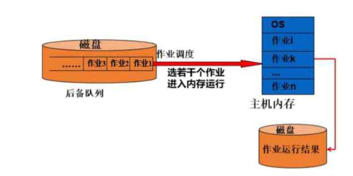
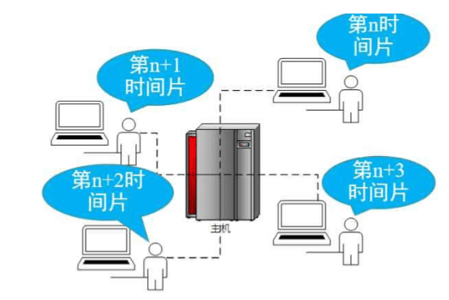
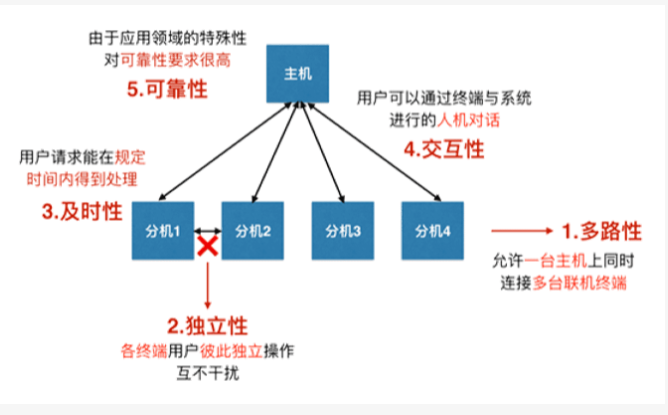
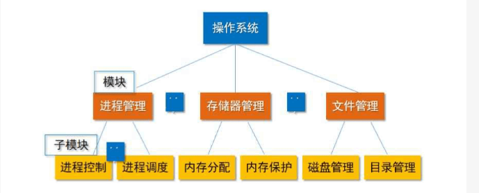
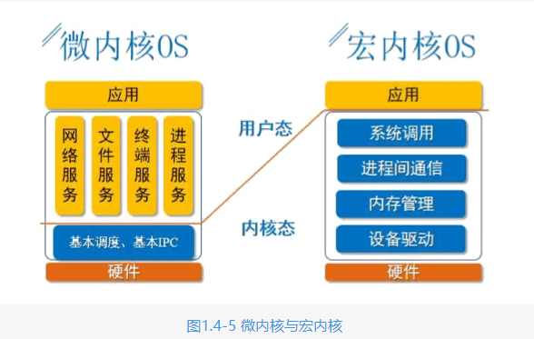
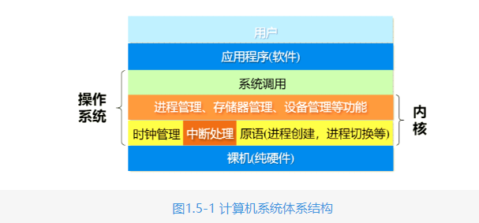
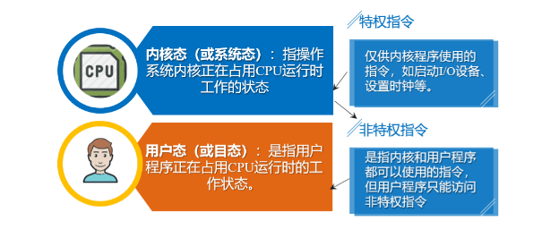
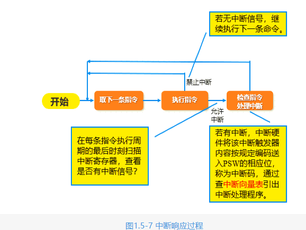
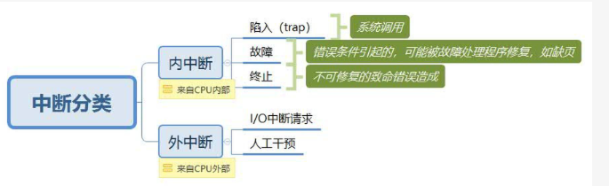
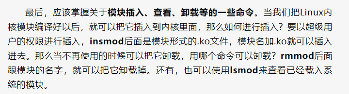

# 操作系统发展

### 单道批处理系统

单道批处理系统有以下特征。
1. 首先是单道性，内存中仅有一道程序；
2. 其次是顺序性，作业顺序进入内存，执行与完成的顺序和调入的顺序完全相同；
3. 自动化，磁盘上的作业在监督程序的控制下逐个一次自动运行。

其缺点是，CPU与外设I/O串行工作，而I/O速度还是太慢，导致CPU利用率依然很低。

### 多道批处理理性系统

一次从磁带或磁盘上同时装入多个用户作业到内存中，使多个作业同时处于运行状态

1. 多道性，内存中有多道程序；
2. 无序性，进入的顺序与结束的顺序可能不一致；
3. 调度性，调度程序要从外存的后备队列中选择作业装入内存。

缺点：无交互能力，程序员不能以交互的方式来控制作业的运行，作业的平均周转时间长。

### 分时系统

每个用户拥有一个终端，轮流使用一台主机，使得每个用户有独占计算机的感觉，可以及时地响应用户的请求，更重要的是，可以人机交互。Unix/Linux就是典型的分时系统。

分时系统的特点：

1. 同时性或多路性：多用户同时操作、使用计算机；
2. 独占性：各终端用户感觉到自己独占了计算机；
3. 及时性：用户的请求能在较短时间内响应；
4. 交互性：用户能计算机进行人──机对话。

### 实时系统

实时操作系统能及时响应外部事件的请求，在规定的时间内完成对该事件的处理，并控制所有实时任务协调一致地运行，

# 操作系统的结构

### 模块化操作系统(Linux)(宏内核)

结构按照操作系统的管理功能进行划分，比如进程管理，内存管理，设备管理，文件管理模块等等。然后，进一步将各个模块再划分为具有一定子功能的模块，依次类推。模块化结构的OS也被称为宏内核或者单模块的OS。

优点:模块之间可以直接调用，除了函数调用的开销外，没有额外开销，因此模块化结构的OS性能比较高。

缺点:模块之间的依赖关系复杂，表现为函数调用深度比较深，降低了模块之间的相对独立性，可维护性比较差。

### 分层结构

从资源管理观点出发划分层次，采用自顶向下的分层设计原则，每一层的设计都是建立在可靠的基础上的，为此规定，每一层只能使用其底层所提供的功能和服务，这样可使得系统的调试和验证变得更容易，使模块间的调用变为有序。

### 微内核结构(鸿蒙)

基于客户/服务器模式的微内核结构,微内核（也就是客户）和多个服务器。微内核一般都采用“机制与策略分离”的设计原理，将机制部分，以及与硬件紧密相关的部分放入微内核，包括进程管理，低级内存管理，中断和陷入处理等，另外的绝大部分功能放在各种服务器上来实现。

优点:可扩展性，可靠性和可移植性都比较好，还提供对分布式系统的支持，因为微内核OS中，客户与服务器之间，以及服务器和服务器之间的通信，是采用消息通信机制进行的，使得微内核OS能很好地支持分布式系统和网络系统。

缺点:性能有所下降，造成这个问题的主要原因，在于客户服务器之间通信的代价。

### 宏内核和微内核区别缺点详解

微内核的缺点是进程间通信的代价大，比如通过提升进程间通信的效率来弥补;宏内核的缺点是可维护性较差，这一缺点，在Linux内核就通过可加载的Linux内核模块，以及一些新的eBPF等机制来弥补，

# 操作系统的运行环境

### 计算机系统层次结构

操作系统运行在CPU、内存、硬盘等计算机硬件之上，为应用程序提供功能调用。内核是计算机上配置的底层软件，是操作系统最基本、最核心的部分，实现操作系统内核功能的那些程序就是内核程序。操作系统内核是与硬件关系较紧密的模块，其中时钟管理实现计时器功能，通过时钟来判断某个时间操作系统该做什么事情；中断处理负责实现中断机制，中断操作可以实现从一种操作转向另一种操作，发生了中断就意味着需要操作系统进行介入，开展管理工作；原语是一种特殊的程序，处于操作系统最底层、最接近硬件的部分，这种程序的运行具有原子性，其运行只能一气呵成，不可中断。

### CPU状态与特权指令

指令就是处理器能够识别,执行的最基本命令.

操作系统为了实现保护与控制，不让用户随意运行不安全的指令，需要给CPU设置两种不同的运行状态，借助程序状态字寄存器（PSW）来完成此机制，用其中的某一个标志位表示当前CPU的状态

### CPU运行现场

CPU的运行现场是指在程序的执行过程中任一时刻状态信息的集合。包括：下一条指令的执行地址，当前指令的执行结果，中断以及屏蔽信息和其他状态的信息，这些信息可以决定CPU下一步执行哪个程序的哪条指令。CPU的现场信息通常存放在下列寄存器中：程序计数器，指令寄存器、程序状态寄存器（PSW）、通用寄存器和其他一些特殊的控制寄存器。处理器的状态放在哪呢，就放在程序状态寄存器（PSW）中。

### 中断,异常,系统调用

### 系统调用

操作系统提供给应用程序使用的接口，可以理解为一种可供应用程序调用的特殊函数，应用程序可以发出系统调用请求来获得操作系统的服务（I/O操作、存储分配、文件管理）。

应用程序通过访管指令（或称自陷指令、中断指令）执行系统调用。

访管指令并不是特权指令。访管指令在用户态执行，执行后会立即引发一个内中断，从而让CPU进入核心态，访管指令是唯一一个只能在用户态执行而不能在核心态执行的指令。

系统调用与中断在处理机制上非常类似，但又有所不同。中断是程序在执行的过程中，随时被打断，正在执行的进程可能在用户态也可能在内核态；但系统调用不同，是用户程序在运行过程中，需要使用操作系统提供的功能的时候，执行现行指令而引发的，只有用户态程序才能调用系统调用，比如，在Linux 中调用了read（）系统调用后，就从用户态切换到内核态，然后就在内核中执行read，从磁盘读取数据等等，执行结束后，又从内核态返回到用户态。

### linux可加载内核模块编程

