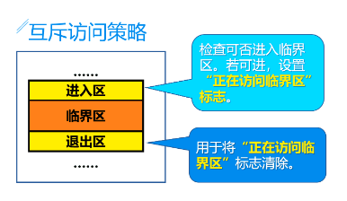

# 进程概述

进程是可以并发执行的程序在某个数据集合上的运行过程，是系统进行资源分配和调度的独立单位。


### 进程的产生

在windows下形成的可执行文件是exe形式，而在Linux下则是ELF形式，当把可执行文件交给操作系统执行以后，程序就摇身一变为进程了。


### 进程的特点


# 进程控制块以及Linux中的task

### 进程控制块(PCB)

* PID:进程标识符(pid_t(无符号整数))
* 处理器现场信息
* 进程调度信息
* 进程控制信息

### task_struck结构


# 进程控制

### 系统态和用户态切换

用户态->内核态
1. 用户程序中通过系统调用访问操作系统服务，例如打开一个文件；
2. 设备中断，当I/O设备操作完成后会触发中断让操作系统介入执行中断处理程序
3. 程序执行异常，例如算术运算被0除。

内核态->用户态
当系统调用、中断、异常返回时发生内核态到用户态的切换

### 进程控制-原语

当CPU需要切换运行进程的时候，就需要对当前进程的运行现场保存起来.保存在进程PCB中，即将CPU寄存器中一些能反映进程当前执行状态的值保存在当前进程PCB中，这些值通常称为CPU现场。

##### 进程的创建

进程创建通过进程创建原语实现

1. 创建一个空白PCB，分配一个唯一的进程标识符；
2. 为新进程的程序和数据分配内存空间；
3. 初始化进程控制块：初始化标识符信息，填入处理机的状态信息（指令指针，栈指针）和控制信息（状态，优先级...）；
4. 设置相应的链接。如: 把新进程加到就绪队列的链表中

##### 进程树

`pstree`

##### 进程的阻塞

程阻塞是进程从运行态到阻塞态的转换，当正在运行的进程等待某一事件发生时引起进程阻塞，如：请求系统服务、等待键盘输入等。

进程阻塞转换的过程是：
进程通过主动调用阻塞原语（block）实现进程的阻塞，block原语的主要目的是将调用进程阻塞，出让CPU使用权。

block原语的主要步骤如下：
1. 使处于运行态的进程停止运行；
2. 将运行现场保存在其PCB的CPU现场保护区；
3. 将PCB中的现行状态由运行态变为阻塞态，并将该进程插入到相应事件的阻塞队列中；
4. 转进程调度程序重新调度，将处理机分配给一个就绪进程，按新进程PCB中的处理机状态设置CPU环境，使它投入运行。


##### 进程的唤醒

进程唤醒是指进程从阻塞态运行到就绪态。当被阻塞进程期待的事件到来时，由中断处理进程或其他产生该事件的进程调用唤醒原语（wakeup），将期待该事件的阻塞进程唤醒。如果该事件是等待I/O设备操作完成，则由硬件提出中断请求，在中断处理程序中寻找并唤醒阻塞进程。如果事件是等待某进程发一个信息，则由发送进程把该等待进程唤醒。 在唤醒原语执行时，将被阻塞进程从相应等队列中移出，并将其PCB中的现行状态由阻塞改为就绪态，然后将该进程插入就绪队列中。


##### 程序的挂起与激活

当进程请求将自己挂起或父进程请求将子进程挂起时, 调用挂起原语（suspend）, 将指定进程挂起。执行过程为: 检查要挂起进程的状态，若处于活动就绪态就将其改为静止就绪态，对于活动阻塞态的进程则将其改为静止阻塞态。如果被挂起的进程正在执行则还要转到调度程序重新调度。

当发生激活进程的事件时，如父进程要激活子进程，调用激活原语（active）将其激活。执行过程为：检查要激活进程的状态, 若是静止就绪态则将其改为活动就绪态,若为静止阻塞态就将其改为活动阻塞态。如果采用的是抢占调度策略,转调度程序重新调度，被激活的进程优先级高则引起重新调度。

##### 进程的终止

一般为正常结束,异常结束(内存越界、写只读文件、执行非法指令、算术运算错、运行超时、IO故障)或者外界干预(系统发生了死锁，需要操作员或操作系统通过终止部分进程解除死锁；父进程请求，比如子进程已完成父进程所要求的任务时，父进程可以提出请求结束该子进程；)

终止原语的执行步骤如下：

1. 从PCB中读取进程的状态；
2. 若进程处于执行态, 应立即终止该进程的执行，并置调度标志为真，以便该进程终止后系统重新进行调度，将处理机分配给新选择的进程，若有子孙进程则将其全部终止，以防它们失控，将该进程所占有的全部资源还给父进程或系统；
3. 将该进程的PCB从所在队列中移出。

# 线程及其模型

线程是OS调度和分派的基本单位，被包含在进程中，一条线程指的是进程内一个执行单元。

进程的特点如下：

1. 操作系统能够进行运算调度的最小单位。
2. 是独立调度和分派的基本单位。
3. 同一进程中的多个线程共享进程中的全部系统资源。
4. 有各自的调用线、寄存器环境。
5. 一个进程可以有很多线程，每条线程并发行不同的任务。 

### 进程和线程的区别

1. 组成不同，进程的实体是程序，PCB与进程一一对应，线程的实体是函数，TCB与其一一对应。
2. 进程既是资源的分配单位，也是独立调度的单位，而线程仅仅是独立调度的单位。
3. 与线程相比，进程的并发度要低。
4. 每个进程拥有自己的资源，而线程共享进程的资源，只拥有堆栈和寄存器等少量资源。


引入线程的优点是：

1. 并发所带来的系统开销变小。
2. 提高了新系统的并发度。
3. 适应新的对称多处理机（SMP）环境的运行，充分发挥其性能。

### 线程分类

线程主要分为用户级线程和内核级线程

用户级线程仅存在于用户空间中，是由应用程序通过线程库完成。所有线程的创建，撤销、调度等管理活动，内核并不知道线程的存在，因此 当用户级线程调用系统调用时，整个进程阻塞。用户级线程的优点是可以运行在任何支持线程库的操作系统上，其缺点是内核只将处理器分配给进程, 同一进程中的两个线程不能同时运行于两个处理器上


内核级线程是指所有线程管理由内核完成的线程，内核维护进程和线程的上下文，线程之间的切换需要内核的支持，以线程为单位进行调度，优点是对多处理器, 内核可以同时调度同一进程的多个线程，多个线程能同时运行于多个处理器上，阻塞是在线程一级完成的，其缺点是同一进程内的线程切换要进入内核, 内核与用户态之间切换的代价比较大，因此性能有所下降，内核级线程


# 线程模型

### 多对一模型

将用户级多个线程映射到一个内核级线程。线程管理由用户空间的线程库完成。当一个线程调用系统调用陷入内核时，整个进程将被阻塞。 一次只有一个线程可以访问内核，因此多个线程无法在多处理器上并行运行


### 一对一模式

对一的关系将一个用户级线程映射到一个内核级线程。与多对一模型相比，此模型提供更多的并发性。 当一个线程调用系统调用陷入内核时，它还允许另一个线程运行。 它支持多个线程在微处理器上并行执行。缺点是创建用户线程时需要相应的内核线程。


### 多对多模型

多对多关系线程模型是任意数量N的用户线程映射到相等或者小于N的内核线程的多路复用/开发人员可以根据需要创建任意数量的用户级线程，并且相应的内核级线程可以在多处理器计算机上并行运行。此模型提供了并发的最佳准确性，当一个线程调用系统调用陷入内核时，内核可以调度另一个线程来执行。


# Linux中进程和线程的创建


### Linux中的进程和线程标识符


### 进程的创建fork()

用户态函数库角度看，创建进程和创建线程调用了不同的函数。分别为fork()和pthread_create()，其对应的系统调用分别为fork()和clone（）


##### fork()

```c
nt sys_fork(struct pt_regs regs)
{
	return do_fork(SIGCHLD, regs.esp, &regs, 0, NULL, NULL);
}
```

个进程都有自己的用户空间，但是调用clone()函数创建的内核线程时共享父进程的用户空间。Linux创建进程采用了写时复制技术，子进程继承父进程的用户空间，父子进程空间的页面的属性为只读，当其中的一个进程试图写入某一个页时，这个页就被复制一份；一段时间之后，子进程就获得与父进程不一样的完全属于自己的用户空间。

##### vfork()

```c
int sys_vfork(struct pt_regs regs)
{
       return do_fork(CLONE_VFORK | CLONE_VM | SIGCHLD, regs.esp, &regs, 0);
}
```
vfork()，直接传递了两个标志过去，第一个标志（CLONE_VFORK），表示儿子优先，老爸等着。于是父进程就去睡觉，等子进程结束才能醒来。第二个标志（CLONE_VM）儿子干脆与父亲待在一个进程的地址空间中，对，就是共享父进程的内存地址空间（父进程的页表项除外）。vfork()看起来很聪明，但从聪明反被聪明误，因为写时复制技术的招数更高，也就是更高效，因此，它没有了生存空间，直接被取代了。

##### clone()

```c
long sys_clone(unsigned long, unsigned long, int __user *,
	       int __user *, unsigned long);
{
        return _do_fork(clone_flags, newsp, 0, parent_tidptr, child_tidptr, tls);
}
```
Linux上创建线程一般使用的是pthread库，实际上linux也给我们提供了创建线程的系统调用，就是clone。

### fork和vfork的区别

fork() 子进程拷贝父进程的数据段，代码段。vfork() 子进程与父进程共享数据段。

fork() 父子进程的执行次序不确定。vfork()保证子进程先运行

### 进程创建代码流程

进程和线程最终的诞生都是调用了`do_fork()`函数

##### do_fork()

首先，调用copy_process()复制父进程的进程控制块。其次， 获得子进程的pid。然后，如果设置了暂停标志，则子进程的状态被设置为暂停。否则，通过唤醒函数将子进程的状态设置为就绪，并且将子进程加入就绪队列。最后，如果使用vfork()创建进程，则阻塞父进程。


##### copy_process()代码流程

copy_process()主要用于创建进程控制块以及子进程执行时所需要的其他数据结构，这个函数主要是为子进程创建父进程PCB的副本，然后对子进程PCB中的各个字段进行初始化。同时，子进程对父进程的各种资源进行复制或共享，具体取决于clone_flags所设置的标志。每种资源的复制或共享都通过形如copy_XXX()这样的函数完成，最后子进程获得了新的pid。


# 进程同步机制


临界资源:又称为互斥资源，是计算机系统中一次只允许一个进程（线程）访问的资源，一旦分配给进程，不能强制剥夺，分为物理资源和逻辑资源两类。物理资源包括打印机、扫描仪等各类I/O设备；逻辑资源包括共享变量、共享文件、控制信号等

共享资源:如CPU、内存，在进程使用期间可以强制剥夺并暂停执行，等待恢复后可以从中断点继续执行而不影响结果正确性。

临界区:并发执行的过程中,访问临界资源必须互斥执行的程序段.其中对临界资源读取或者修改的操作均称为访问.


同步机制的基本原则

1. 空闲让进：当无进程在临界区时，此时临界资源处于空闲状态，任何请求的进程均可以进入临界区；
2. 忙则等待：当有进程进入自己的临界区时，此时临界资源正被访问，其他任何试图进入临界区的进程必须等待，以保证进程互斥地访问临界资源；
3. 有限等待：对请求访问临界资源的进程，应保证进程能在有限时间能够进入临界区，以避免长期处于“饥饿”状态；
4. 让权等待：当进程不能进入自己的临界区时，应立即释放CPU资源，以免进程陷入“忙等”状态，浪费宝贵的CPU资源。

### 互斥访问策略



起初的软件方法和硬件方法均存在一些问题.

目前广泛使用的是信号量方法

# 信号量机制

### 整型信号量

信号量为表示临界资源的一个整型量S。S>0时表示有S个资源可用；S<=0表示该资源已被分配完。定义了两个原语wait(S)和signal(S)用于资源的分配和释放

```c
wait(int &S){  //P(S)
     while (S<=0);
     S = S-1;
}
signal(int  &S){ //V(S)  
     S = S+1;
}
```

wait原语首先通过while循环测试是否S<=0，如果是则继续等待，否则将S的值减1，资源分配成功，可以进入临界区访问。signal原语只有一条语句，即将S值加1，表示释放1个资源。也称P-V操作

注意事项:wait和signal原语操作必须成对出现并且不能出现顺序错误、重复或者遗漏；遗漏wait原语则不能保证互斥访问；遗漏signal原语会导致使用临界资源之后不能将其释放供其他等待的进程使用。

使用策略:确定各进程的临界区；定义一个整型信号量S，初始值为1；
将一对wait(s)和signal(s)原语放在各进程临界区的上面和下面。

问题:在wait原语中，一旦S<=0，则调用进程处于“忙等”状态，效率低下，违反了“忙则等待”的原则。

### 记录型信号量

为解决整型信号量存在的“忙等”问题，当没有资源可用时，我们需要将申请资源的进程阻塞起来，让出CPU让其他进程执行，仅当有资源释放时再将其唤醒继续执行。在具体实施方案上，首先需要对整型信号量进行扩充，引入阻塞进程队列，这就是记录型信号量semaphore，它为一个结构体，包含整型成员value和阻塞进程队列L，L为进程链接指针，指向申请资源但没有获得资源的阻塞进程队列队首。当value>0时，表示当前可用的资源个数；value<0时，|value|为L中被阻塞的进程个数。


在wait原语中，先直接将S.value减1，预分配1个资源，然后判断是否S.value<0，如果成立，表明没有资源可用，调用block原语将当前进程阻塞到进程阻塞队列S.L的末尾，并且将进程的指令计数器定位在wait操作之后；如果S.value<0不成立，说明资源分配成功，则当前进程可以继续执行，


在signal原语中，先直接将S.value加1，释放1个资源，然后判断S.value是否小于等于0，如果成立，表明S的进程阻塞队列中有进程等待资源，则按照先来先分配的原则，调用wake原语唤醒队首进程让其继续执行。被唤醒的进程由于在wait操作时已经预分配过资源，因此在唤醒后，将直接执行wait操作之后的程序代码。


### AND型信号量

记录型信号量一次只能申请一种资源中的一个，当某进程需要获得多种临界资源才能执行时,资源申请顺序不当很容易产生死锁。为解决此问题，引入了AND信号量，允许一次申请多种资源，每种资源申请1个，当申请的资源都满足需要时全部分配，否则一种资源也不分配。

### 信号量集

一次需要n种资源，每种资源申请多个，且资源可用数低于下限时不予分配，为方便软件开发，对AND型信号量机制进行扩充，定义了信号量集。

### 记录型信号量与信号量集的比较

1. 记录型信号量一次只能申请1种资源的1个；信号量集每次可申请多种资源，每种资源申请d_i个。
2. 记录型信号量值小于1不分配；信号量集只要有一个信号量值小于t_i不分配。
3. 记录型信号量先减1后判断；信号量集先判断，满足分配条件后将每个信号量的值减d_i。
4. 记录型信号量自我阻塞后，将当前进程放到阻塞队列末尾，并将程序计数器定位到wait操作之后，被唤醒后将直接访问对应临界区资源；信号量集阻塞到第1个信号量值小于分配下限的信号量的阻塞队列里，程序计数定位到Swait起点，被唤醒后需要重新申请资源。
5. 记录型信号量的signal操作唤醒对应阻塞队列的队首进程；信号量集的Ssignal操作会唤醒传入的n个信号量的所有阻塞进程。

# 进程间通信


### 管道通信


管道机制的能力是互斥，当一个进程正在对管道进行读/写操作时，
另一个进程必须等待。二是同步，当写（输入）进程把一定数量（如4KB）数据写入管道后，便去睡眠等待，直到读（输出）进程取走数据后，再把它唤醒。当读进程读到管道为空时，也应睡眠等待，直至写进程将数据写入管道后，才将它唤醒。最后要确定对方是否存在，只有确定对方已存在时，进程通信才能发生。

### 共享内存

共享内存也就是说两个进程可以直接共享访问同一块内存区域。

### 消息队列


