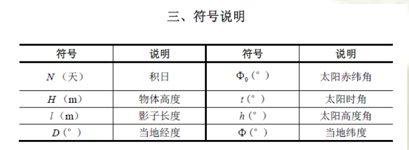
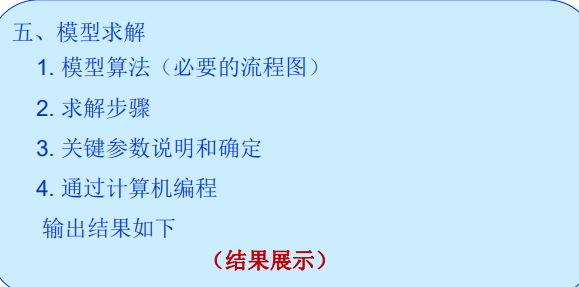
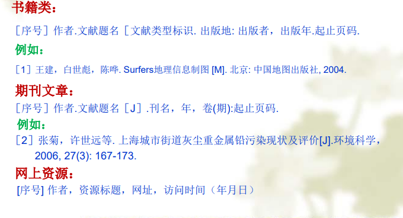
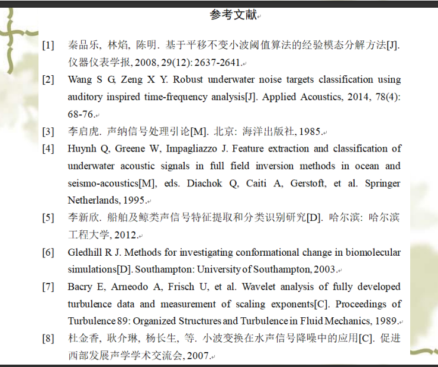

# 数模论文写作格式总结报告

## 题目

题目需要化龙点金或者很有特色或原题目

## 摘要

### 基本格式

* 第一段,高度概括论文中心(4行左右)
* 然后针对每一问，写一段话(包含以下要素)
```
    说明用什么方法,建立了什么模型,求解模型的思路和方法,只要结果,包括数值结果
    以及结论,模型的检验结果如何
```

### 写作要求

* 文字简介,逻辑清晰;
* 摘要应具有独立性和自明性,并且拥有与正文同等量的主要信息
* 篇幅:一页纸的3/4,*独立成页*
* 原文中的所有问题，逐一回答
* 不用引文,尽量不要有数学符号以及图表

## 问题重述

* 根据自己的理解,使用自己的语言清楚简明的阐述背景,条件和要求
* 切忌完整拷贝原文

## 模型假设

* 作用:简化明确问题   要求:关键性假设不能缺
* 来源：
    1. 题目本身隐含的假设
    2. 解决问题需要的假设

一般4~8条为适宜

## 符号说明

1. 只对论文中*出现频率较高*或者*比较重要*的符号在符号说明部分进行集中说明,出现频率较低的符号在文中使用的地方加以说明
2. 不管符号说明部分是否已经对某符号说明过,该符号在文中*首次*出现时,依然需要进行说明
3. 符号最好以表格形式出现,注意美观

eg：

## 问题分析与模型建立

问题分析阐述解决问题的基本思路,关键环节和希望给出的主要结果

---

模型建立则死问题分析提供思路的具体实现过程

## 模型建立以及数学模型

* 建模前一定要有总体思路和规划
* 按照对问题的分析过程,有条理,有逻辑的阐明建模的每一个详细步骤,必要的推导,计算,中间结果都应该明确的给出
* 最终给出一个具有明确表达式的数学模型
* 建议使用小标题,给出解决思路

## 模型求解
  
* 阐明方法的设计或选择,方法的思想依据及步骤
* 应用或建立必要的数学命题和定理
* 若不能求出精确解,通常可采用如下两种处理方法：
    * 简化模型(近似求解)
    * 简化算法(局部求解)
* 切忌在模型求解时只写结果

eg：


## 结果表示

* 最终数值结果的正确性和合理性是第一位的
* 结果要集中,一目了然,直观,便于比较分析
* 数值结果表示:精心设计表格或图形,展示结果

## 结果分析,检验

* 精度怎样? 误差或相对误差,残差等
* 稳定性怎样?敏感性分析,对参数求导数等
* 相应的一些检验标准,F检验等
* 与已知数据比较等

## 模型的评价及改进

* 评价:优点要突出,缺点不回避
* 改进:提出一些新的思路,使问题更精确,也使模型的得到进一步优化

## 参考文献

* 只列出论文中确实应用了其中的方法或结论的文献
* 正文中按参考的先后次序标出后面的文献序号
* 参考文献的格式

eg：



## 附录

* 详细的结果,详细的数据表格可以在此列出
* 主要结果数据应在正文列出,不怕重复
* 完整程序,如果全文没有程序,必须说明()